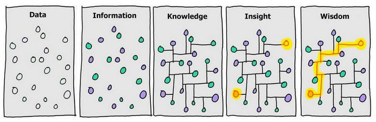

# notes [](https://github.com/hb-research)  [](https://humanbrain.gitbook.io/notes/)  


The notes for Math, Machine Learning, Deep Learning and Research papers.


## Objective



<p align="center">
Illustration by <a href="http://www.smrvl.com/blog/">David Somerville</a> based on the original by <a href="https://twitter.com/gapingvoid/statuses/423952995240648704">Hugh McLeod</a>
</p>

<br/>

- Let's make **wisdom** from knowledge.
- Define concepts to be intuitively understandable.
    * Simply summary (You can check the details on Wiki)
    * With `story` or example
    * Draw an `illustration`
    * If possible, append a `code`
- Documentation by [Gitbook](https://humanbrain.gitbook.io/notes/)

## Usage

- Sync papers (* recommend path like Google Drive's sync folder) 
 
```
python scripts/sync_papers.py {SYNC_PATH}
```

- Make `SUMMARY.md`

```
python scripts/make_summary.py
```

---


## Knowledge Source

### Math

- Course & Video
	* [Statistics 110: Probability - Projects at Harvard](https://www.youtube.com/playlist?list=PL2SOU6wwxB0uwwH80KTQ6ht66KWxbzTIo)
	* [Mathematics for Machine Learning: Linear Algebra by David Dye](https://www.coursera.org/learn/linear-algebra-machine-learning)

### Machine Learning
	
- Course & Video
	* [Stanford University - Machine Learning](https://www.coursera.org/learn/machine-learning) by Andrew Ng.
	* [Stanford University - Probabilistic Graphical Models](https://www.coursera.org/course/pgm) by Daphne Koller
	* [OXFORD University - Machine Learning](https://www.cs.ox.ac.uk/people/nando.defreitas/machinelearning/)

### Deep Learning

- Book
    * [Deep Learning](http://www.deeplearningbook.org/) by Ian Goodfellow Yoshua Bengio and Aaron Courville, 2016

- Course & Video
	* [Stanford University - CS231n: Convolutional Neural Networks for Visual Recognition](http://cs231n.stanford.edu/index.html) by Fei-Fei Li, Andrej Karpathy, Justin Johnson
	* [Udacity - Deep Learning](https://www.udacity.com/course/deep-learning--ud730) by Vincent Vanhoucke, Arpan Chakraborty
	* [Toronto University - Neural Networks for Machine Learning](https://www.coursera.org/course/neuralnets) by Geoffrey Hinton
	* [CS224d: Deep Learning for Natural Language Processing](http://cs224d.stanford.edu/index.html) by Richard Socher
	* [Deep Learning School (bayareadlschool)](http://www.bayareadlschool.org/) September 24-25, 2016 Stanford, CA
	* [Oxford Deep NLP 2017](https://github.com/oxford-cs-deepnlp-2017/lectures) by  Phil Blunsom and delivered in partnership with the DeepMind Natural Language Research Group.