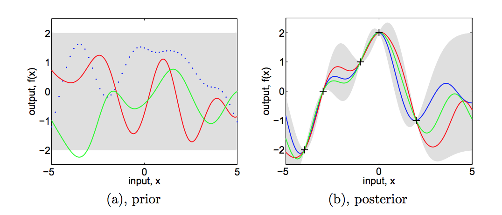
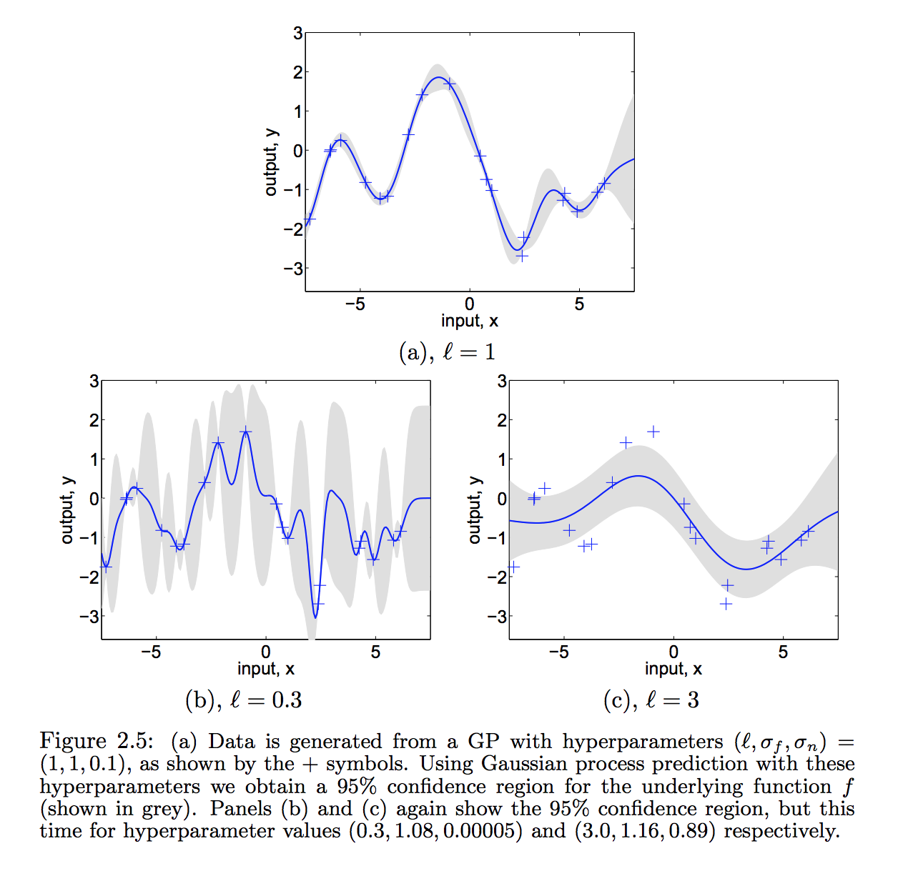

# Gaussian Process

- Gaussian Processes (GP) are a generic supervised learning method designed to solve regression and probabilistic classification problems.

## Simple Summary

- **Gaussian process** is a particular kind of statistical model where observations occur in a continuous domain, e.g. time or space. In a Gaussian process, every point in some continuous input space is associated with a normally distributed random variable.

- Univariate Gaussians: distributions over real valued variables
- Multivariate Gaussians: {pairs, triplets, ...} of real valued vars
- Gaussian Processes: functions of (infinite numbers of) real valued variables -> `regression`

- Pros:
	- The prediction interpolates the observations (at least for regular kernels).
	- The prediction is probabilistic (Gaussian) so that one can compute empirical confidence intervals and decide based on those if one should refit (online fitting, adaptive fitting) the prediction in some region of interest.
	- Versatile: different kernels can be specified. Common kernels are provided, but it is also possible to specify custom kernels.
	- Non-parametric, Bayesian method
- Cons:
	- They are not sparse, i.e., they use the whole samples/features information to perform the prediction.
	- They lose efficiency in high dimensional spaces – namely when the number of features exceeds a few dozens.