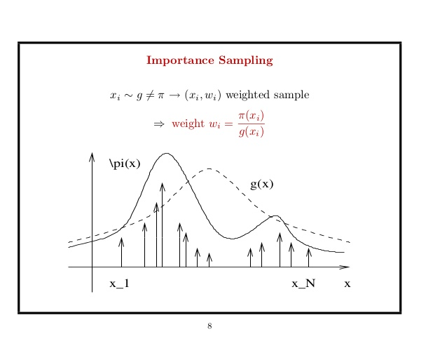
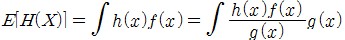

# Importance Sampling

- In statistics, **importance sampling** is a general technique for estimating properties of a particular distribution, while only having samples generated from a different distribution than the distribution of interest. It is related to umbrella sampling in computational physics. Depending on the application, the term may refer to the process of sampling from this alternative distribution, the process of inference, or both.

## Simple Summary

- Importance Sampling is a kinds of approximation technique.
- Approximate the expected value by sampling rather than directly from the distribution p(x)
- Each sample has an importance, and using it, finding the expectation.

- g(x) = proposal distrubution and using Monte Carlo, compute E[H(X)] 