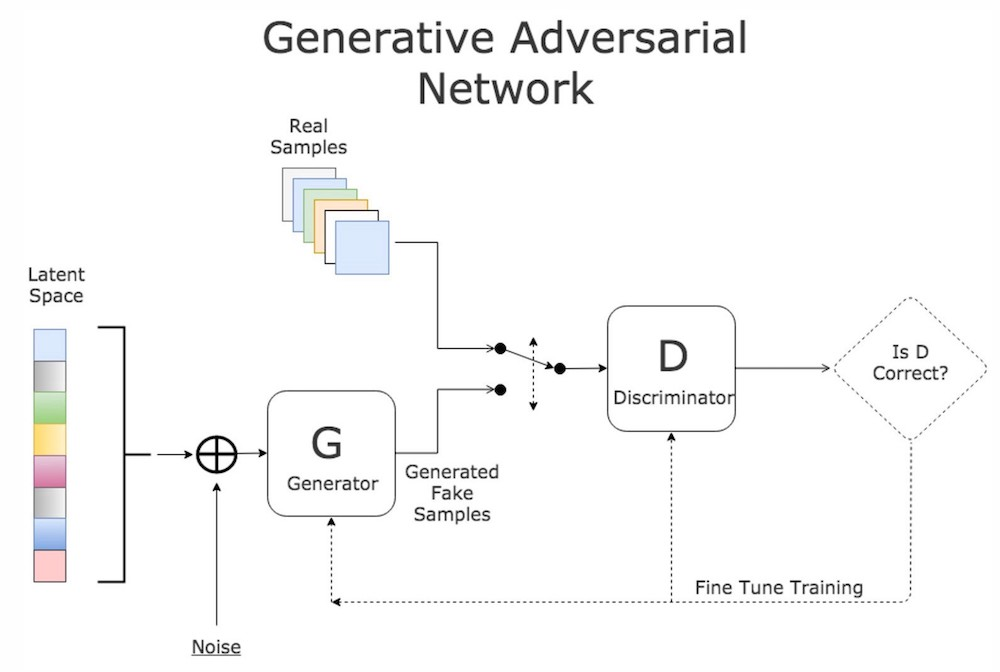
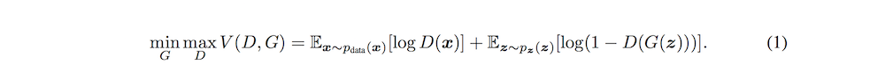
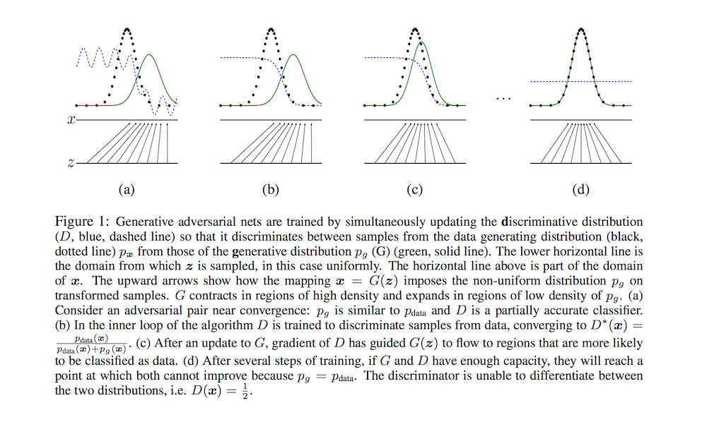
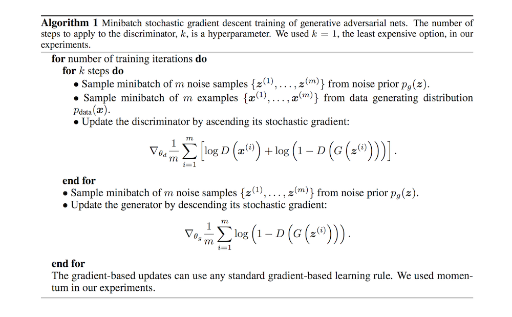

# Generative Adversarial Networks

- Submitted on 2014. 6
- Ian J. Goodfellow, Jean Pouget-Abadie, Mehdi Mirza, Bing Xu, David Warde-Farley, Sherjil Ozair, Aaron Courville and Yoshua Bengio

## Simple Summary

>   A new framework for estimating generative models via an adversarial process, in which we simultaneously train two models: a generative model G that captures the data distribution, and a discriminative model D that estimates the probability that a sample came from the training data rather than G. The training procedure for G is to maximize the probability of D making a mistake. This framework corresponds to a minimax two-player game. In the space of arbitrary functions G and D, a unique solution exists, with G recovering the training data distribution and D equal to 1/2 everywhere.

- two-player minimax game with value function V (G, D):

- In practice, train G to maximize log D(G(z)).

- Algorithm

- Theoretical Results
	- Global Optimality of p\_g = p\_data
	- Theorem 1. The global minimum of the virtual training criterion C(G) is achieved if and only if p\_g = p\_data. At that point, C(G) achieves the value − log 4.
	- Proposition 2. If G and D have enough capacity, and at each step of Algorithm 1, the discriminator is allowed to reach its optimum given G, and pg is updated so as to improve the criterion then p\_g converges to p\_data.

- Pros:
	- Markov chains are never needed.
	- no inference is needed during learning
	- a wide variety of functions can be incorporated into the model.
	- they can represent very sharp, even degenerate distributions
- Cons:	
	- there is no explicit representation of p\_g(x)
	- D must be synchronized well with G during training
	- G collapses too many values of z to the same value of x to have enough diversity to model p\_data (mode collapse)