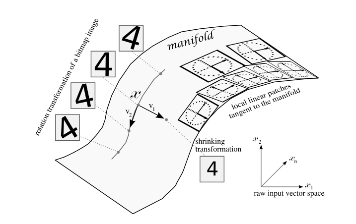
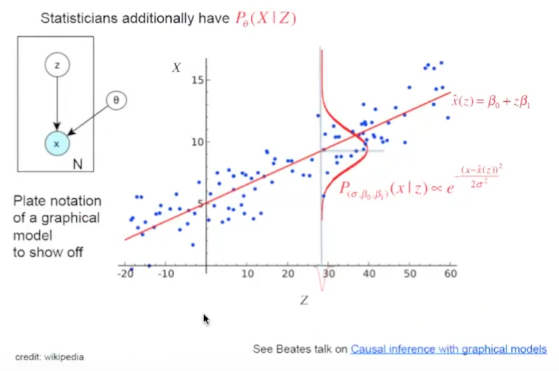
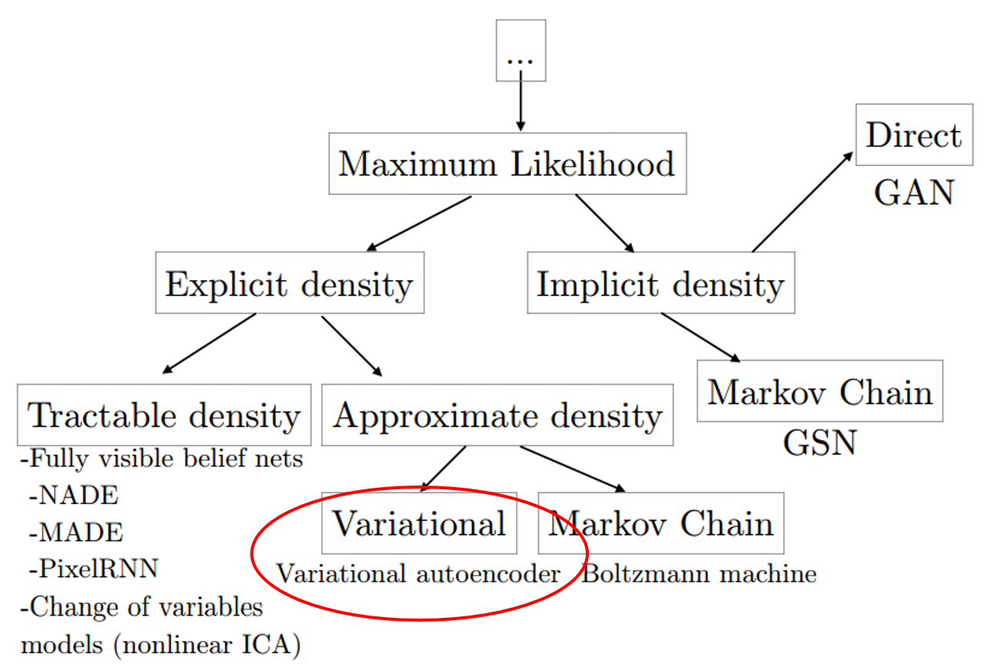
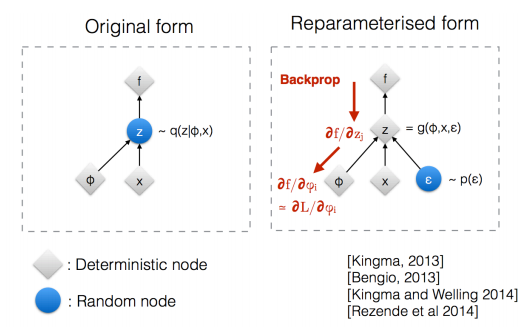
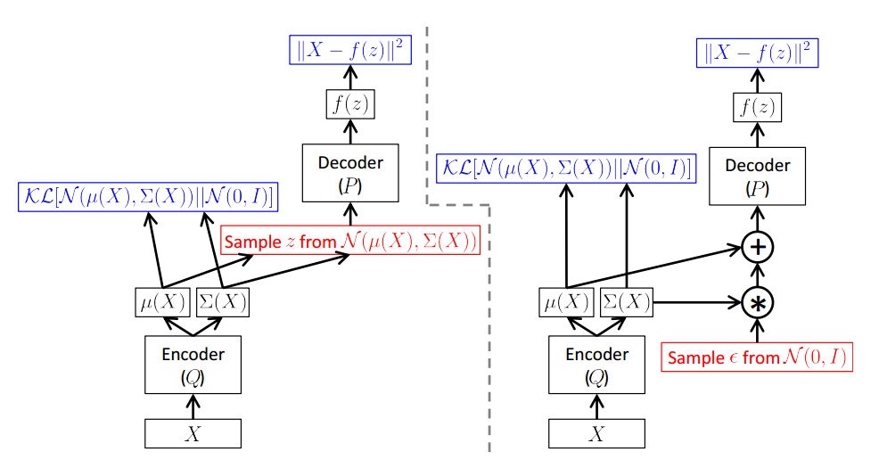
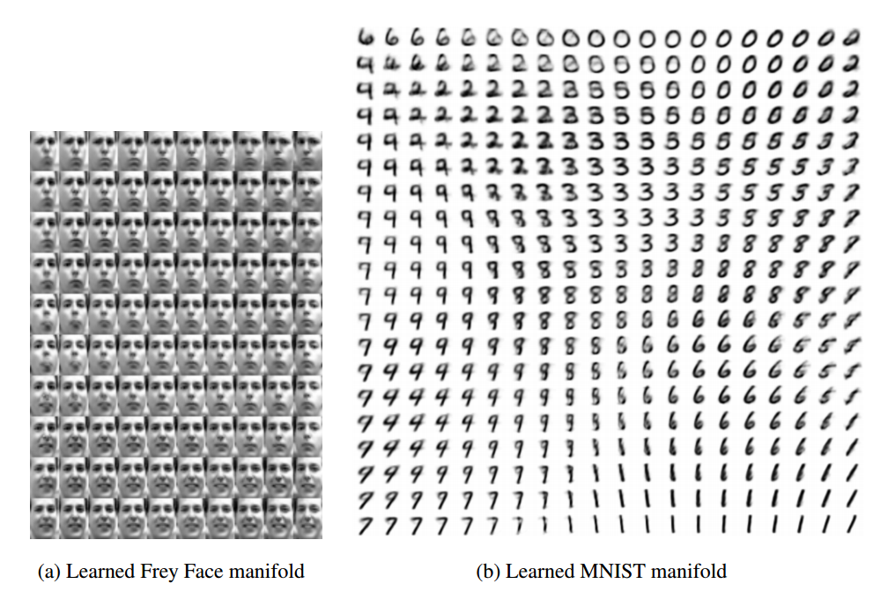

# Auto-Encoding Variational Bayes

- published in 2013. 12
- Kingma, Diederik P., and Max Welling.

## Simple Summary

> introduce stochastic variational inference and learning algorithm that efficient inference and learning in directed probabilistic models, in the presence of continuous latent variables with intractable poesterior distributions, and large dataset.

1. reparameterization of the variational lower bound yields a lower bound estimator that can be straightforwardly optimized using a standard stochastic gradient methods.
2. datasets with continuous latent varialbes per datapoint, posterior inference can be made especially efficient by fitting an approximate inference model to the intractable posterior using the proposed lower bound estimator.

### Manifold Hypothesis

- data is concentrated around a lower dimensional manifold

### Linear Regerssion

- auto-encoder find the red line
- VAE is find the red line and the distribution of data

### Algorithms

- Reparameterised Trick

### Experiments

- Results

