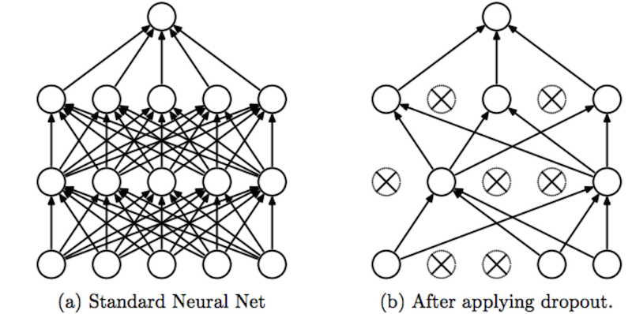

## Dropout

- [Improving neural networks by preventing
co-adaptation of feature detectors](https://arxiv.org/pdf/1207.0580.pdf) (2012. 7) by GE Hinton
- [Dropout: a simple way to prevent neural networks from overfitting.](https://www.cs.toronto.edu/~hinton/absps/JMLRdropout.pdf) (2014) by N Srivastava

----

### Simple summary

- Overfitting can be reduced by using “dropout” to prevent complex **co-adaptations** on the
training data.
- Dropout is a layer type. It has a parameter α∈(0,1). The output dimensionality of a dropout layer is equal to its input dimensionality. With a probability of α any neurons output is set to 0. At testing time, the output of all neurons is multiplied with α to compensate for the fact that no output is set to 0.
- Dropout can be interpreted as training an **ensemble of many networks**, which share weights. It can also be seen as a regularizer.