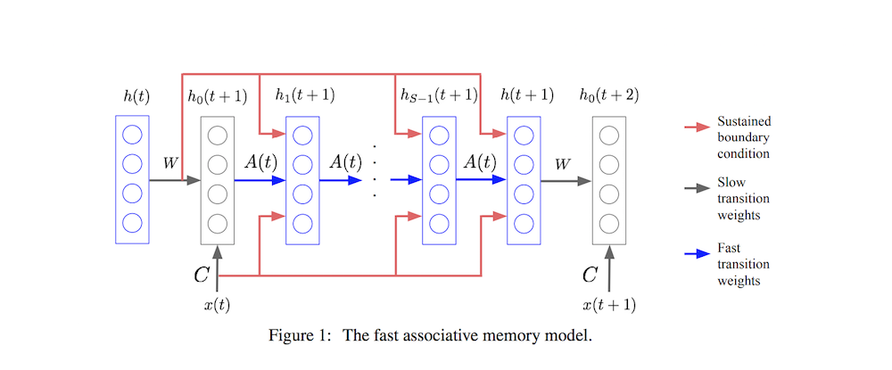

# Using Fast Weights to Attend to the Recent Past

- Submitted on 2016. 10
- Jimmy Ba, Geoffrey Hinton, Volodymyr Mnih, Joel Z. Leibo and Catalin Ionescu

## Simple Summary

> Synapses have dynamics at many different time-scales and this suggests that artificial neural networks might benefit from variables that change slower than activities but much faster than the standard weights. These "fast weights" can be used to store temporary memories of the recent past and they provide a neurally plausible way of implementing the type of attention to the past that has recently proved very helpful in sequence-to-sequence models. By using fast weights we can avoid the need to store copies of neural activity patterns.

- interesting implications for computational neuroscience and cognitive science.
	-  The ability of people to recursively apply the very same knowledge and processing apparatus to a whole sentence and to an embedded clause within that sentence or to a complex object and to a major part of that object has long been used to argue that neural networks are not a good model of higher-level
cognitive abilities.
- neural networks could benefit from a third form of memory that has much higher storage capacity than the neural activities but much faster dynamics than the standard slow weights.
	- This memory could store information specific to the history
of the current sequence so that this information is available to influence the ongoing processing without using up the memory capacity of the hidden activities

- Fast Associative Memory

- h(τ): current hidden state vector
- h_s(t+1): during the iterative inner loop
- each iteration of the inner loop, the fast weight matrix is exactly equivalent to attending to past hidden vectors in proportion to their scalar product with the current hidden vector, weighted by a decay factor.
- During the inner loop iterations, attention will become more focussed on past hidden states that manage to attract the current hidden state.
- applying layer normalization on each iteration of the inner loop makes the fast associative memory more robust to the choice of learning rate and decay hyper-parameters.