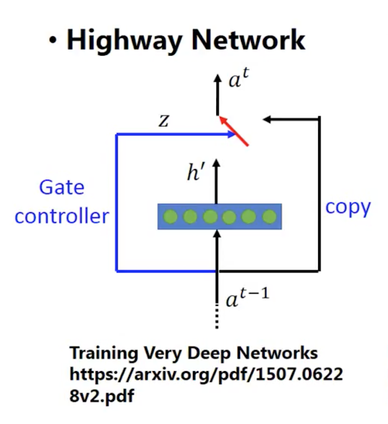
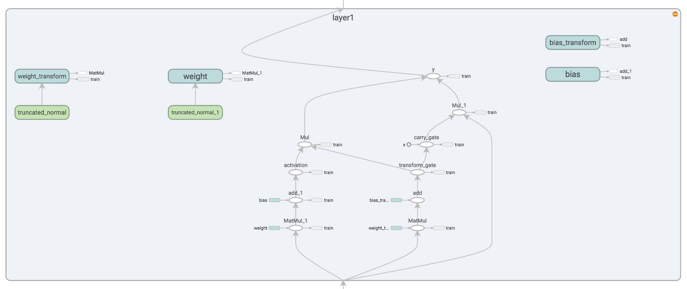

# Training Very Deep Networks

- published in 2015. 7
- Rupesh Kumar Srivastava, Klaus Greff and Jürgen Schmidhuber

## Simple Summary

- Highway networks allow unimpeded information flow across many layers on information highways (inspired by LSTMs).
- Apply LSTM-like gating to networks layers. Transform gate T and carry gate C.
- A highway layer in TensorBoard.

