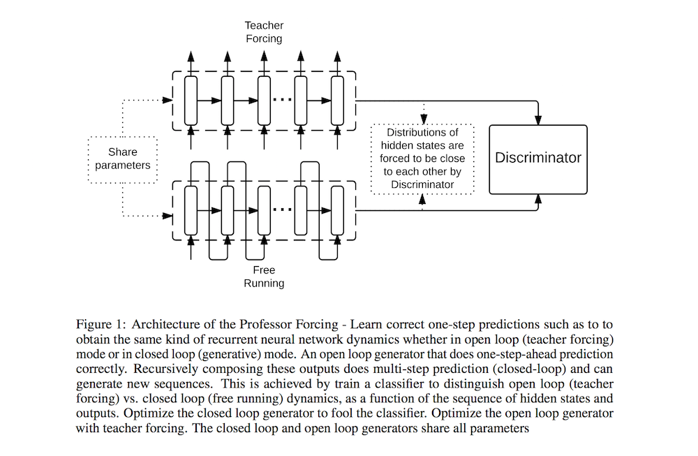

# Professor Forcing: A New Algorithm for Training Recurrent Networks

- Submitted on 2016. 10
- Alex Lamb, Anirudh Goyal, Ying Zhang, Saizheng Zhang, Aaron Courville and Yoshua Bengio

## Simple Summary

>  The Teacher Forcing algorithm trains recurrent networks by supplying observed sequence values as inputs during training and using the network's own one-step-ahead predictions to do multi-step sampling. We introduce the Professor Forcing algorithm, which uses adversarial domain adaptation to encourage the dynamics of the recurrent network to be the same when training the network and when sampling from the network over multiple time steps. ... Empirically we find that Professor Forcing acts as a regularizer, improving test likelihood and the model qualitatively improves samples

- Problem: sample from the joint distribution over the sequence by each y_i can result in problems in generation as small prediction error compound in the conditioning context. 
	- So, propose an alternative way of training RNNs which explicitly seeks to make the generative behavior and the teacher-forced behavior match as closely as possible.

- take advantage of the generative adversarial networks (GANs) framework.
	- to achieve that second objective of matching the two distributions over sequences (the one observed in teacher forcing mode vs the one observed in free-running mode).
- Generator: a unidirctional RNN with MLE training objective
- Descriminator: a bidirectional RNN + MLP

- Training Objective: NLL + C_f + C_t (optional)

- Contributions
	- improve long-term sequence sampling from recurrent networks
	- act as a regularizer for recurrent networks
	- When running an RNN in sampling mode, the region occupied by the hidden states of the network diverges from the region occupied when doing teacher forcing.
	- In some domains the sequences available at training time are shorter than the sequences that we want to generate at test time. (scheduled sampling cannot be used)