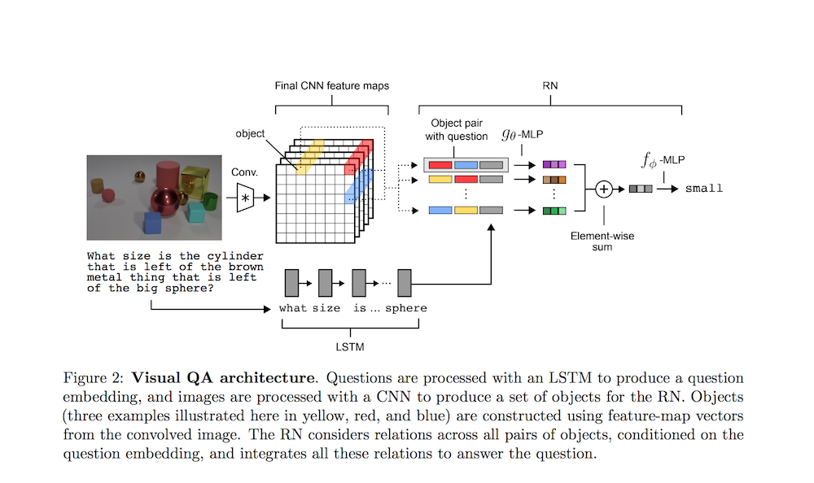

# A simple neural network module for relational reasoning

- Submitted on 2017. 6
- Adam Santoro, David Raposo, David G.T. Barrett, Mateusz Malinowski, Razvan Pascanu, Peter Battaglia and Timothy Lillicrap

## Simple Summary

>  Relation Networks (RNs) as a simple plug-and-play module to solve problems that fundamentally hinge on relational reasoning. We tested RN-augmented networks on three tasks: visual question answering using a challenging dataset called CLEVR, on which we achieve state-of-the-art, super-human performance; text-based question answering using the bAbI suite of tasks; and complex reasoning about dynamic physical systems

- The difficulty of reasoning relations
	- Symbolic approaches - define relations between symbols using logic languages, and reason the relations using deduction and algebra.
	- Statistical learning - build representations from raw data and generalize across diverse and noisy conditions

- Pros:
	1. Learn to Infer relations: All-to-all
	2. RNs are data efficient: Single function g to compute each relation
	3. Operate on a set of objects: Order invariant

- Tasks
	1. CLVER : 95.5 % (super-human preformance)
	2. Sort-of-CLEVR : > 94%
	3. bAbi: Succeeded on 18/20 tasks
	4. Dynamic physical systems: 93% conntion, 95% counting