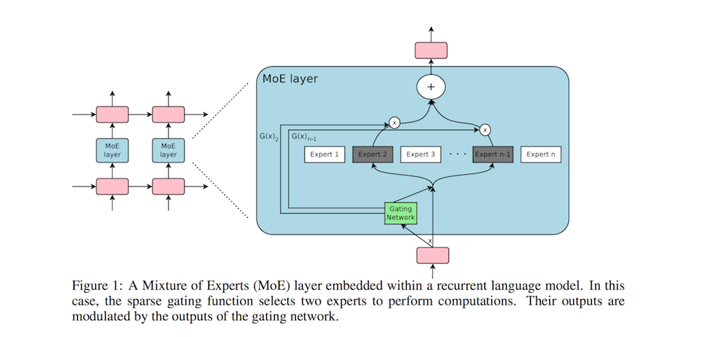
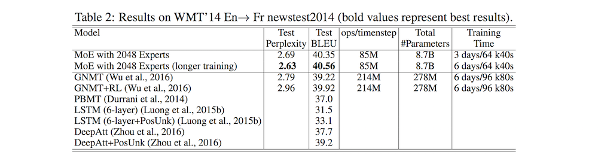

# Outrageously Large Neural Networks: The Sparsely-Gated Mixture-of-Experts Layer

- Submitted on 2017. 1
- Noam Shazeer, Azalia Mirhoseini, Krzysztof Maziarz, Andy Davis, Quoc Le, Geoffrey Hinton and Jeff Dean

## Simple Summary

> Introduce a Sparsely-Gated Mixture-of-Experts layer (MoE), consisting of up to thousands of feed-forward sub-networks. A trainable gating network determines a sparse combination of these experts to use for each example. ... address large capacity challenges and finally realize the promise of conditional computation, achieving greater than 1000x improvements in model capacity with only minor losses in computational efficiency on modern GPU clusters.

- introduce a general-purpose mechanism to scale up neural networks significantly beyond their current size using sparsity of activation.
- Challenges
	- Modern computing devices (GPU): propose turning on/off large chunks of the
network with each gating decision.
	- Large batch sizes are critical for performance
	- Network bandwidth can be a bottleneck
	- Depending on the scheme, loss terms may be necessary to achieve the desired level of sparsity per-chunk and/or per example.
	- Model capacity is most critical for very large data sets.

- The MoE consists of a number of experts, each a simple feed-forward neural network, and a trainable gating network which selects a sparse combination of the experts to process each input.

- G(x): output of the gating network
	- Softmax Gating: apply Softmax function
	- Noisy Top-K Gating: add sparsity and noise
- E_i(x): the output of the i-th expert network for a given input x.

- The Shrinking Batch Problem: each expert receives a much smaller
batch of approximately kb/n << b examples.
	- Mixing Data Parallelism and Model Parallelism
	- Taking Advantage of Convolutionality
	- Increasing Batch Size for a Recurrent MoE
- Balancing Expert Utilization	
	- the gating network tends to converge to a state where it always produces
large weights for the same few experts -> take a soft constraint approach

- Experiments 

