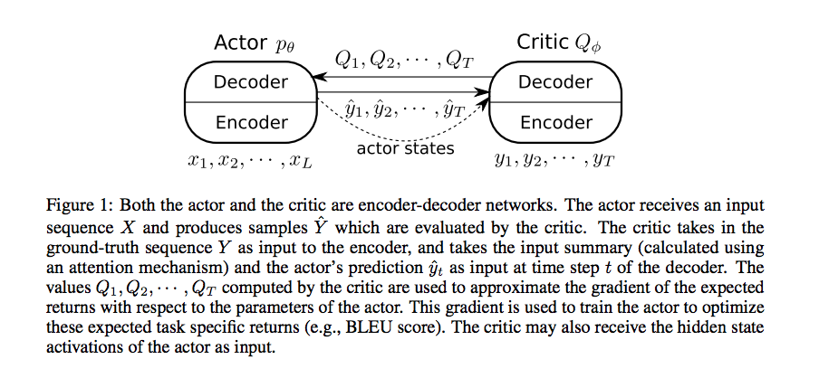
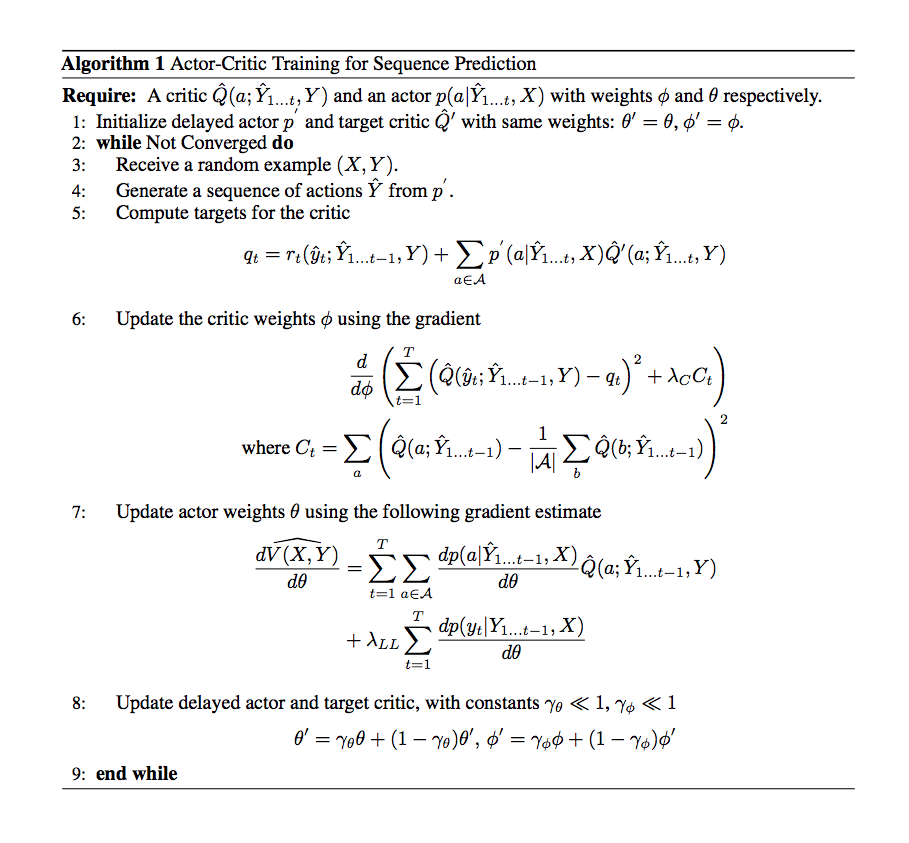

# An Actor-Critic Algorithm for Sequence Prediction

- Submitted on 2016. 7
- Dzmitry Bahdanau, Philemon Brakel, Kelvin Xu, Anirudh Goyal, Ryan Lowe, Joelle Pineau, Aaron Courville and Yoshua Bengio

## Simple Summary

> An approach to training neural networks to generate sequences using actor-critic methods from reinforcement learning (RL). Current log-likelihood training methods are limited by the discrepancy between their training and testing modes, as models must generate tokens conditioned on their previous guesses rather than the ground-truth tokens. ...This results in a training procedure that is much closer to the test phase, and allows us to directly optimize for a task-specific score such as BLEU

- made from the machine translation results is that the training methods that use generated predictions have a strong regularization effect. Our understanding is that conditionin on the sampled outputs effectively increases the diversity of training data.