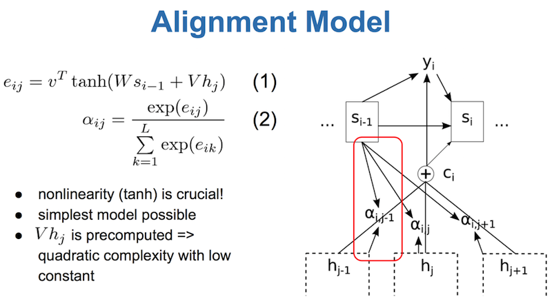
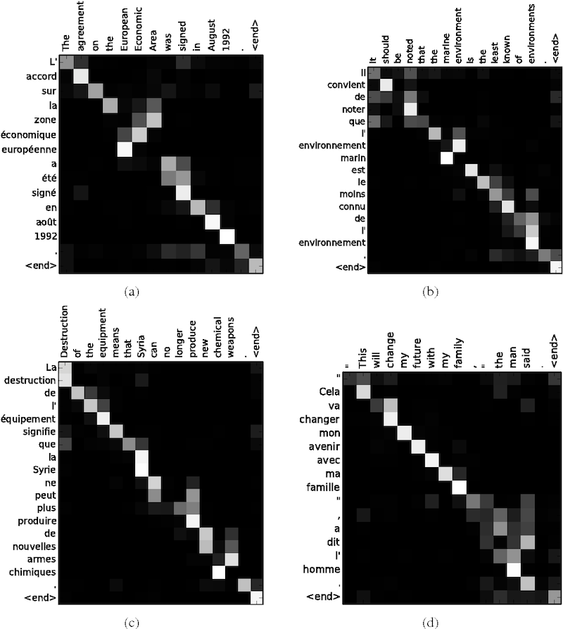

# Neural Machine Translation by Jointly Learning to Align and Translate

- published in 2014. 9
- Dzmitry Bahdanau, Kyunghyun Cho and Yoshua Bengio

## Simple Summary

- Conjecture that the use of a fixed-length vector is a bottleneck in improving the performance of this basic encoder-decoder architecture, and propose to extend this by allowing a model to automatically (soft-)search for parts of a source sentence that are relevant to predicting a target word, without having to form these parts as a hard segment explicitly

- Proposed **attention** mechanism to standard Seq2Seq model.
- Huge improvements in dealing with long sentences.
- Visualize the attention matrix

