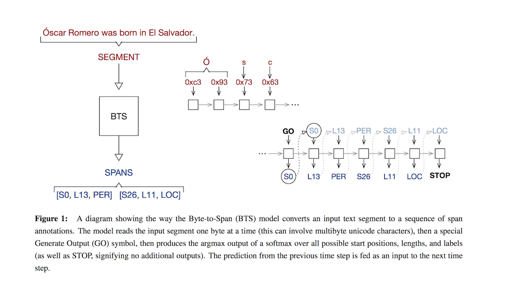

# Multilingual Language Processing From Bytes

- published in 2015. 12
- Dan Gillick, Cliff Brunk, Oriol Vinyals and Amarnag Subramanya

## Simple Summary

- An LSTM-based model which we call Byte-to-Span (BTS) that reads text as bytes and outputs span annotations of the form [start, length, label] where start positions, lengths, and labels are separate entries in our vocabulary.
- Text in many languages with a single model. Due to the small vocabulary size, these multilingual models are very compact, 

- Experiments
	- POS Tagging: 13 languages, 2.87M tokens, 25.3M training segments
	- NER: 4 languags, 0.88M tokens, 6M training segments 

- Contributions
	1. use the bytes in variable length unicode encodings as input. allows us to train a multilingual model that improves over single-language models without using additional parameters. and byte-dropout (by randomly replacing them with a `DROP` symbol.)
	2. the model produces span annotations, where each is a sequence of three outputs
	3. the models are much more compact than traditional word-based systems and they are standalone – no processing pipeline is needed.
