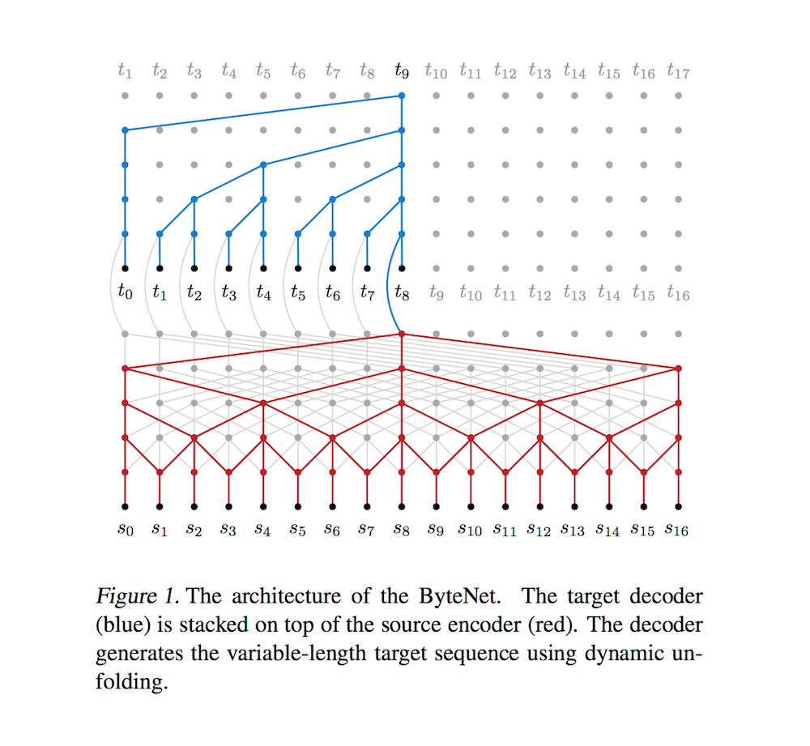
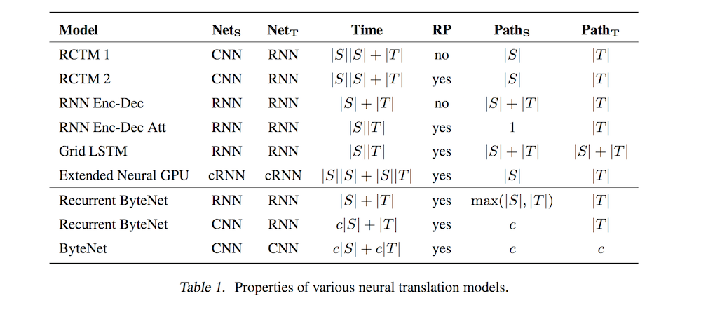

# Neural Machine Translation in Linear Time

- Submitted on 2016. 10
- Nal Kalchbrenner, Lasse Espeholt, Karen Simonyan, Aaron van den Oord, Alex Graves and Koray Kavukcuoglu

## Simple Summary

>  The ByteNet is a one-dimensional convolutional neural network that is composed of two parts, one to encode the source sequence and the other to decode the target sequence. The two network parts are connected by stacking the decoder on top of the encoder and preserving the temporal resolution of the sequences. To address the differing lengths of the source and the target, we introduce an efficient mechanism by which the decoder is dynamically unfolded over the representation of the encoder. The ByteNet uses dilation in the convolutional layers to increase its receptive field.

- Seq2Seq (RNN) model's drawbacks grow more severe as the length of the sequences increases.
- Machine Translation Desiderata
	1. the running time of the network should be linear in the length of the source and target strings.
	2. the size of the source representation should be linear in the length of the source string, i.e. it should be resolution preserving, and not have constant size.
	3. the path traversed by forward and backward signals in the network (between input and ouput tokens) should be short. 

- ByteNet
	- Encoder-Decoder Stacking: for maximize the representational bandwidth between the encoder and the decoder
	- Dynamic Unfolding: generates variable-length outputs (maintaining high bandwidth and being resolution-preserving)
	- Input Embedding Tensor
	- Masked One-dimensional Convolutions: The masking ensures that information from future tokens does not affect the prediction of the current token.
	- Dilation: Dilation makes the receptive field grow exponentially in terms of the depth of the networks, as opposed to linearly.
	- Residual Blocks

- The ByteNet also achieves state-of-the-art performance on character-to-character machine translation on the English-to-German WMT translation task, surpassing comparable neural translation models that are based on recurrent networks with attentional pooling and run in quadratic time.

- similar WaveNet + PixelCNN