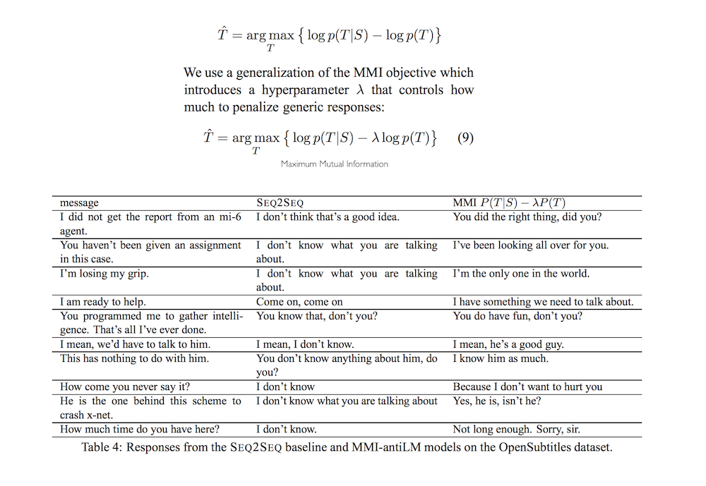

## A Diversity-Promoting Objective Function for Neural Conversation Models

- published in 2015. 11
- Jiwei Li, Michel Galley, Chris Brockett, Jianfeng Gao, Bill Dolan

----

### Simple summary

- Sequence-to-sequence neural network models for generation of conversational responses tend to generate safe, commonplace responses (e.g., "I don't know") regardless of the input.
- Propose using **Maximum Mutual Information (MMI)** as the objective function.

