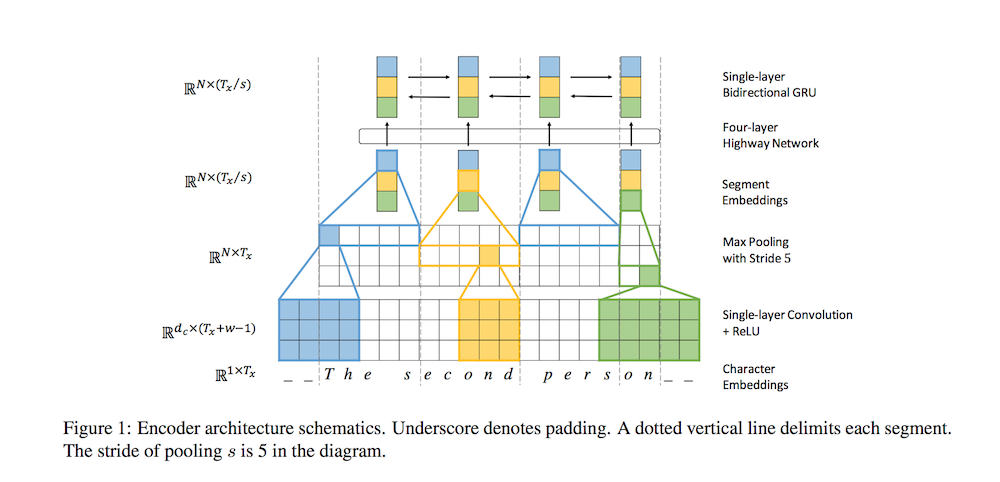
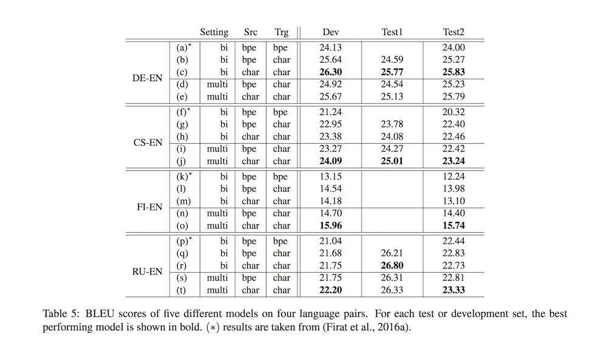

# Fully Character-Level Neural Machine Translation without Explicit Segmentation

- Submitted on 2016. 10
- Jason Lee, Kyunghyun Cho and Thomas Hofmann

## Simple Summary

>  introduce a neural machine translation (NMT) model that maps a source character sequence to a target character sequence without any segmentation. We employ a character-level convolutional network with max-pooling at the encoder to reduce the length of source representation, allowing the model to be trained at a speed comparable to subword-level models while capturing local regularities.

- Why Character-Level?
	1. do not suffer from out-of-vocabulary issues
	2. are able to model different, rare morphological variants of a word
	3. do not require segmentation
	4. character-level translation system can easily be applied to a multilingual translation setting
	5. no longer inject our knowledge of words and word boundaries into the system (by not segmenting source sentences into words)

- Encoder (images)
- Attention: 
	- single-layer feedforward network computes the attention score of next target character to be generated with every source segment representation.
- Decoder:
	- A standard two-layer character-level, takes the source context vector from
the attention mechanism and predicts each target character.

- usually char2char performance is better than others.