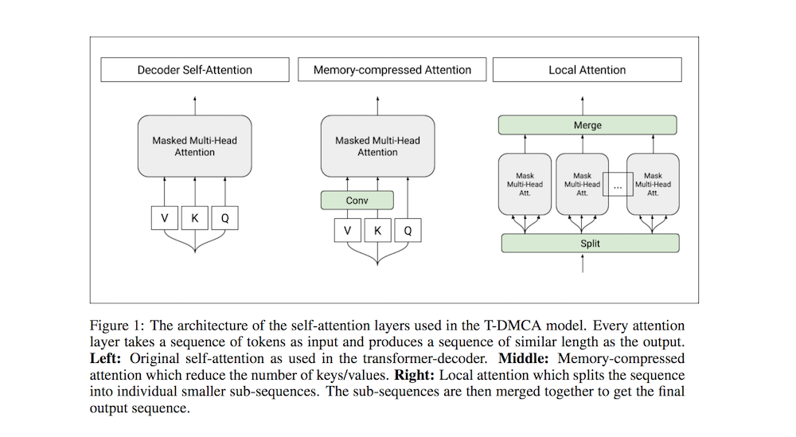
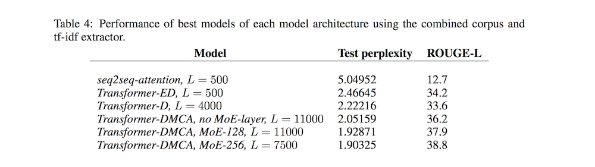

# Generating Wikipedia by Summarizing Long Sequences

- Submitted on 2016. 11
- Minjoon Seo, Aniruddha Kembhavi, Ali Farhadi and Hannaneh Hajishirzi

## Simple Summary

> Generating English Wikipedia articles can be approached as a multi-document summarization of source documents. We use extractive summarization to coarsely identify salient information and a neural abstractive model to generate the article. For the abstractive model, we introduce a decoder-only architecture that can scalably attend to very long sequences, much longer than typical encoder- decoder architectures used in sequence transduction. We show that this model can generate fluent, coherent multi-sentence paragraphs and even whole Wikipedia articles.

- Task of multi-document summarization with a large, parallel dataset, and demonstrated a two-stage extractive-abstractive framework for carrying it out.

- Extractive Stage
	- Identity, **tf-idf**, TextRank, SumBasic, Cheating (ranks {p^i_j} using recall of bigrams in the ground truth text)
	- First relavant paragraphs are extracted from reference documents and documents retrieved through search engine queries through a TD-IDF-based ranking. 

	
- Abstractive Stage
	- sub-word tokenization
	- seq2seq-att, T-ED, T-D
	- Transformer Decoder with Memory-Compressed Attention (**T-DMCA**)
	- add a mixture of experts layer to increase the network’s capacity

- Experiment
	- Metric: ROUGE-L F1 and language modeling's
	- The abstractive model contribution is shown for the best combined tf-idf-T-DMCA model

