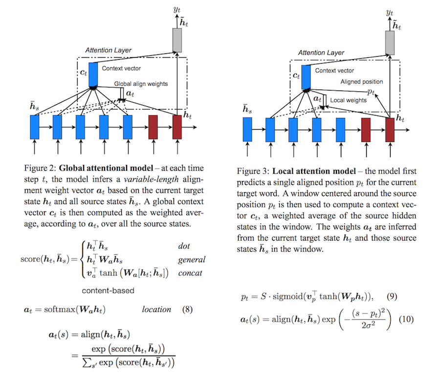
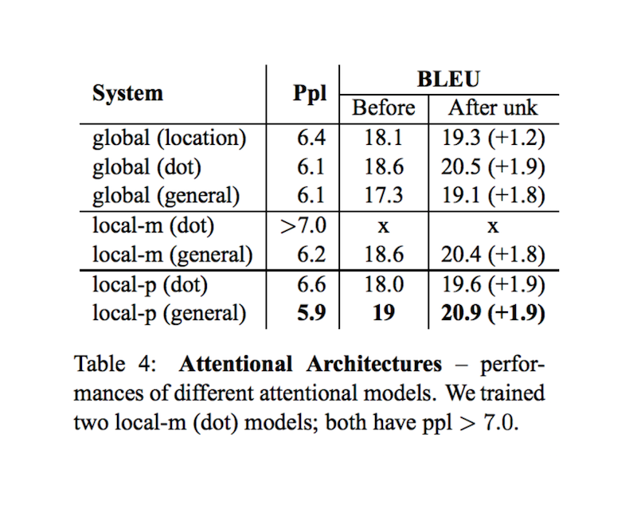

# Effective Approaches to Attention-based Neural Machine Translation

- published in 2015. 8
- Minh-Thang Luong, Hieu Pham and Christopher D. Manning

## Simple Summary

- This paper examines two simple and effective classes of attentional mechanism: a **global approach** which always attends to all source words and a **local one** that only looks at a subset of source words at a time.

- concat is [Bahdanau Attention](https://arxiv.org/abs/1409.0473) mechanism
- local attention mechanism selectively focuses on a small window of context (avoiding the expensive computation)

- The location-based function does not learn good alignments.
- It is interesting to observe that dot works well for the global attention and general is better for the local attention.

