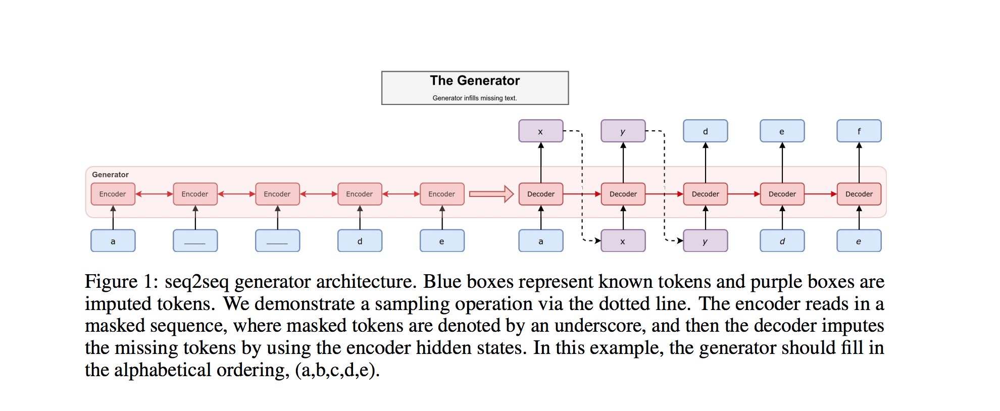

# MaskGAN: Better Text Generation via Filling in the______

- Submitted on 2018. 1
- William Fedus, Ian Goodfellow, Andrew M. Dai

## Simple Summary

> Propose to improve sample quality using Generative Adversarial Networks (GANs), which explicitly train the generator to produce high quality samples and have shown a lot of success in image generation. GANs were originally designed to output differentiable values, so discrete language generation is challenging for them. We claim that validation perplexity alone is not indicative of the quality of text generated by a model. We introduce an actor-critic conditional GAN that fills in missing text conditioned on the surrounding context. 

- Using GAN to generate samples in adversarial setup in texts has been limited due to the mode collapse and training instability issues. As a remedy to these problems an in-filling-task conditioning on the surrounding text has been proposed
- The approach is to use an actor-critic to train the generator of the GAN and use the usual maximum likelihood with SGD to train the discriminator.

- Architecture
	- use Seq2Seq and generator consists of an encoding module and decoding module.
	- encoder reads in the masked sequence.
	- generator decomposes the distribution over the sequence into an ordered conditional sequence.

- Failure Cases
	- Mode Dropping is less extreme than SeqGAN but still noticeable
	- Matching Syntax at Boundaries
	- Loss of Global Context