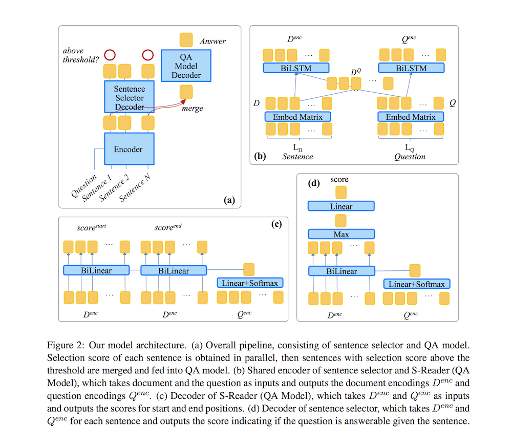
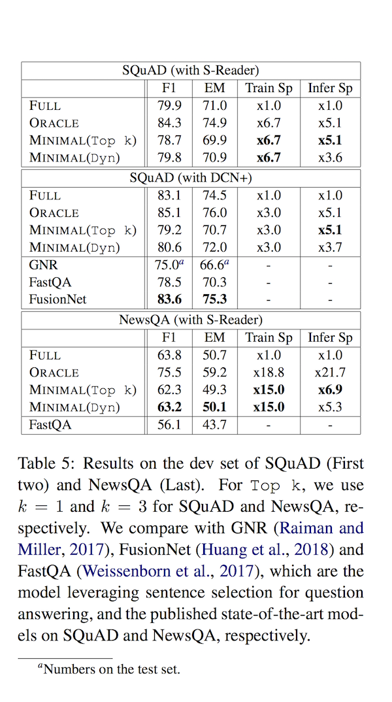

# Efficient and Robust Question Answering from Minimal Context over Documents

- Submitted on 2018. 5
- Sewon Min, Victor Zhong, Richard Socher, Caiming Xiong

## Simple Summary

> study the minimal context required to answer the question, and find that most questions in existing datasets can be answered with a small set of sentences. Inspired by this observation, we propose a simple sentence selector to select the minimal set of sentences to feed into the QA model. Our overall system achieves significant reductions in training (up to 15 times) and inference times (up to 13 times), with accuracy comparable to or better than the state-of-the-art on SQuAD, NewsQA, TriviaQA and SQuAD-Open. Furthermore, our experimental results and analyses show that our approach is more robust to adversarial inputs.

- Aim to develop a QA system that is scalable to large documents.
	- SQuAD dataset, 92% of answerable questions can be answered using a single sentence.
	- propose a sentence selector to select the minimal set of sentences to give to the QA model in order to answer the question.

- Sentence selector scores each sentence with respect to the question in parallel. The score indicates whether the question is answerable with this sentence.
	- Selector outperforms the previous state-of-the-art (Tan et al., 2018)

- Experiments

- `Dyn`: Dynamic, `Top k`: 1 for SQuAD and 3 for NewsQA

