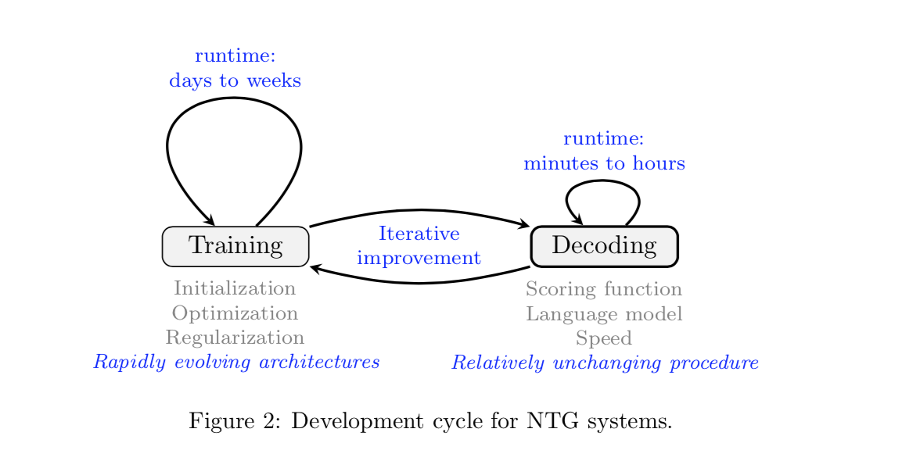
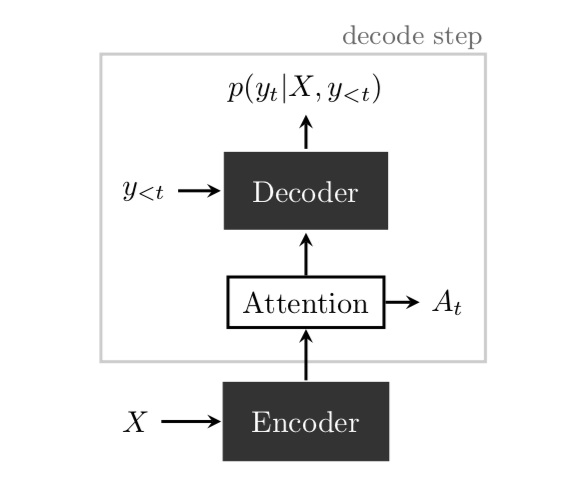

# Neural Text Generation: A Practical Guide

- published in 2017. 11
- Ziang Xie

## Simple Summary

- Practivate guide for diagnosing and resolving pathological behavior during decoding.
- The primary focus is on tasks where the target is a single sentence hence the term "text generation" as opposed to "language generation".

### Preprocessing

- Ultimately, if using word tokens, it's important to use a consistent tokenization scheme for all inputs to the system - this includes handling of contractions, punctuation marks such as quotes and hyphens, periods denoting abbrevations (nonbreaking prefixes) vs. sentence boundaries, character escaping, etc.

### Model

- RNN
	- use shared parameter matrices across different time steps and combine the input at the current time step with the previous hidden state summarizing all previous time steps.
- CNN
	- Convolutions with kernels reused across timesteps can also be used with masking to avoid peeking ahead at future inputs during trainig. 
- Attention
	- Attention mechanism acts as a shortcut connection between the target output prediction and the relevant source input hidden states.

### Training

- Optimize over the model parameters θ the sequence cross-entropy loss.
- recent research has also explored other methods
	- using RL or separate adversarial loss
		- [Adversarial Learning for Neural Dialogue Generation](https://arxiv.org/abs/1701.06547) (2017. 1)
		- [Wasserstein gan](https://arxiv.org/abs/1701.07875) (2017. 1)
- Useful heuristics
	- Sort the next dozen or so batches of sentences by length
	- training set is small, tuning regularization
	- Measure validation loss after each epoch and anneal the learning rate when validation loss stop decreasing.
	- Periodically checkpoint model parameters and measure downstream performance.
	- Ensembling almost always improves performance.

### Decoding

- During decoding, we are given the source sentence X and seek to generate the target Y^ that maximizes some scoring function s(Y^)^2.
- Beam Search
	- surprising result with neural models is that relatively small beam size yield good results with rapidly dimishing return. Further, larger beam sizes can event yield (slightly) worse results.
- When measuring the score function, Useful metrics include:
	- Average length of decoded outputs Y^ vs average length of reference targets Y.
	- s(Y^) vs s(Y), then inspecting the ratio s(Y^)/s(Y). If the average ratio is especially low, then there may be a bug in the beam search, or the beam size may need to be increased. If the average ratio is high, then the scoring fuction may not be appropriate.
	- For some applications computing edit distance (insertions, substitutions, deletions) between Y^ and Y my also be useful.

#### Common issues.

- Rare and out-of-vocabulary (OOV) words
	- [Neural machine translation of rare words with subword
units](https://arxiv.org/abs/1508.07909) (2015. 8)
	- [Google’s neural machine translation system: Bridging the gap between human and machine translation](https://arxiv.org/abs/1609.08144) (2016 .9)
- Docoded output short, truncated or ignore portions of input
	- normalizing the log-probability score and ading ad length bonus.
	- [Modeling coverage for neural machine translation](https://arxiv.org/abs/1601.04811) (2016. 1)
	- [Google’s neural machine translation system: Bridging the gap between human and machine translation](https://arxiv.org/abs/1609.08144) (2016 .9)
- Decoded output repeats
	- easily detected using the attention matrix A with some manually selected threshold.
	- [Get to the point: Summarization with pointer-generator
networks](https://arxiv.org/abs/1704.04368) (2017. 4)
- Lack of diversity
	- Increasing the temperature τ of the softmax exp(zi/τ)/ Sigma_j exp(zj/τ) is a simple method for trying to encourage more diversity in decoded outputs.
	- [A Diversity-Promoting Objective Function for Neural Conversation Models](https://arxiv.org/abs/1510.03055) (2015. 10)
	- [A simple, fast diverse decoding algorithm for neural generation](https://arxiv.org/abs/1611.08562) (2016. 11)

### Attention

- basic attention mechanism used to "attend" to portions of the encoder hidden states during each decoder timestep has many extensions and applications.

### Evaluation

- Common metric based n-gram
	- [ROUGE](https://en.wikipedia.org/wiki/ROUGE_(metric))
	- [BLUE](https://en.wikipedia.org/wiki/BLEU)
- Need metric
	- [Why We Need New Evaluation Metrics for NLG](https://arxiv.org/abs/1707.06875) (2017. 6)