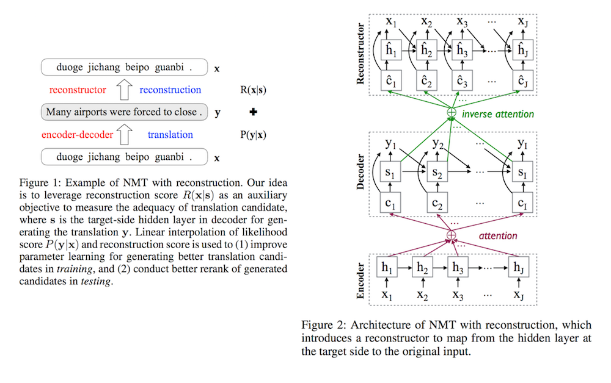

# Neural Machine Translation with Reconstruction

- Submitted on 2016. 11
- Zhaopeng Tu, Yang Liu, Lifeng Shang, Xiaohua Liu and Hang Li

## Simple Summary

> Propose a novel encoder-decoder-reconstructor framework for NMT. The reconstructor, incorporated into the NMT model, manages to reconstruct the input source sentence from the hidden layer of the output target sentence, to ensure that the information in the source side is transformed to the target side as much as possible.

- Standard Seq2Seq NMT faces two main problems
	1. Translations generated by NMT systems often lack of adequacy.
	2. Likelihood objective is suboptimal in decoding

- So, Added reconstructor reads the hidden state sequence from the decoder and outputs a score of exactly reconstructing the input sentence. (as asupervised auto-encoder in the sense that the latent representation is not only used to reconstruct the source sentence, but also used to generate the target sentence.)

- the newly added reconstructor introduces an auxiliary score to measure the adequacy of translation candidates.
	1. it improves parameter training for producing better translation candidates.
	2.  it consistently improves translation performance when the decoding space increases.