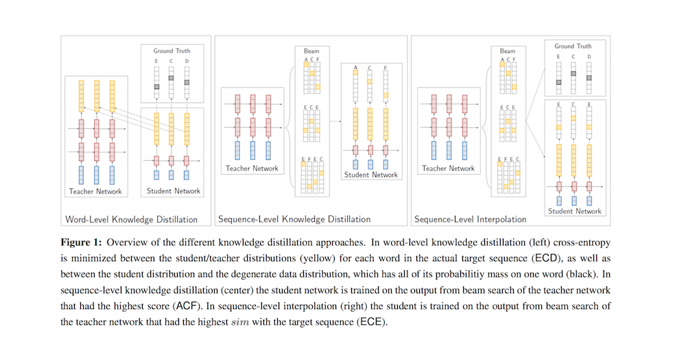
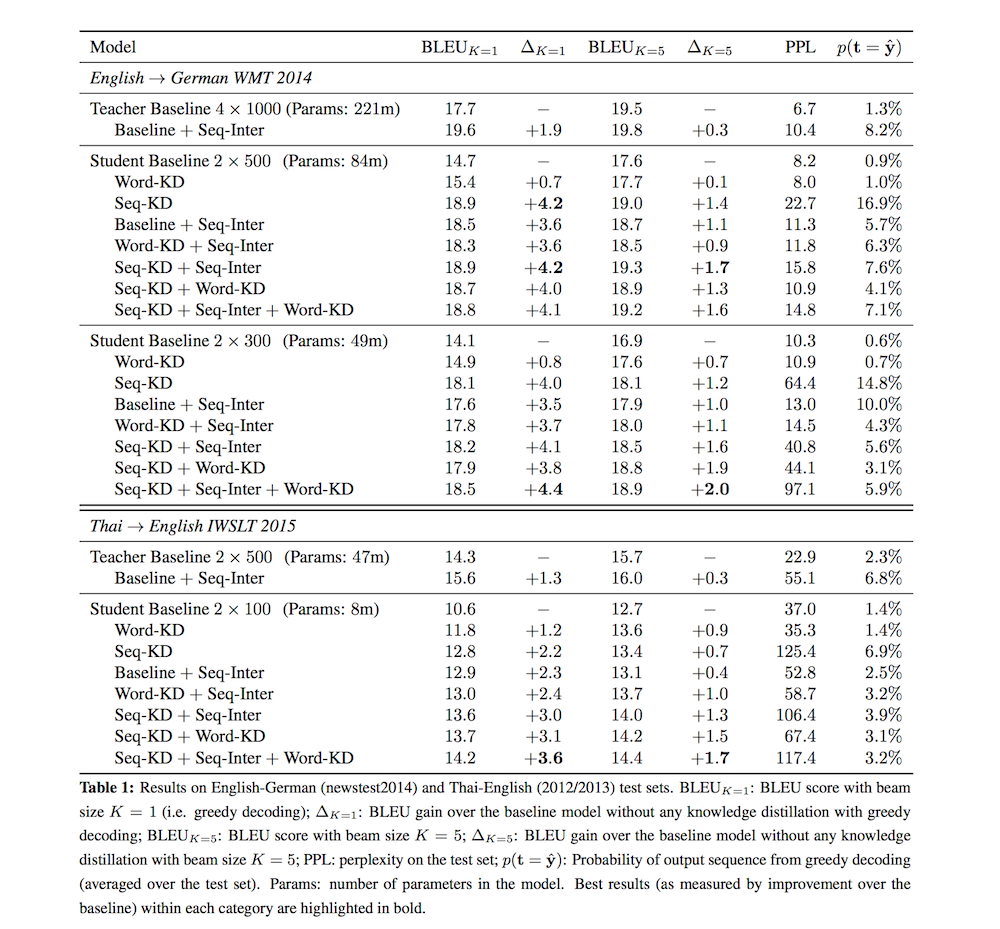

# Sequence-Level Knowledge Distillation

- Submitted on 2016. 6
- Yoon Kim and Alexander M. Rush

## Simple Summary

> knowledge distillation approaches (Bucila et al., 2006; Hinton et al., 2015) that have proven successful for reducing the size of neural models in other domains to the problem of NMT. We demonstrate that standard knowledge distillation applied to word-level prediction can be effective for NMT, and also introduce two novel sequence-level versions of knowledge distillation that further improve performance, and somewhat surprisingly, seem to eliminate the need for beam search (even when applied on the original teacher model). 

- Knowledge distillation describes a class of methods for training a smaller student network to perform better by learning from a larger teacher network.

- this new objective has no direct term for the training data, it is common practice to interpolate between the two losses.
- `L(θ; θT ) = (1 − α)LNLL(θ) + αLKD(θ; θT )`
- Knowledge Distillation for NMT
	1. Word-Level Knowledge Distillation (Word-KD): if we have a teacher model, standard knowledge distillation for multi-class cross-entropy can be applied.
	2. Sequence-Level Knowledge Distillation (Seq-KD): 
		1. train a teacher model
		2. run beam search over the training set with this model
		3. train the student network with cross-entropy on this new dataset.
	3. Sequence-Level Interpolation (Seq-Inter): use generate a response that has high probability under the teacher model and is similar to the ground truth and then have both mixture terms use it.

