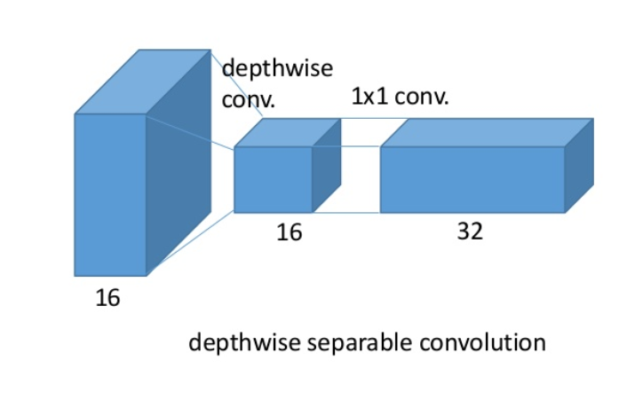
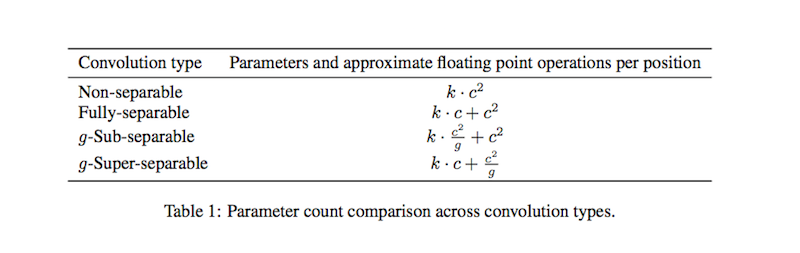
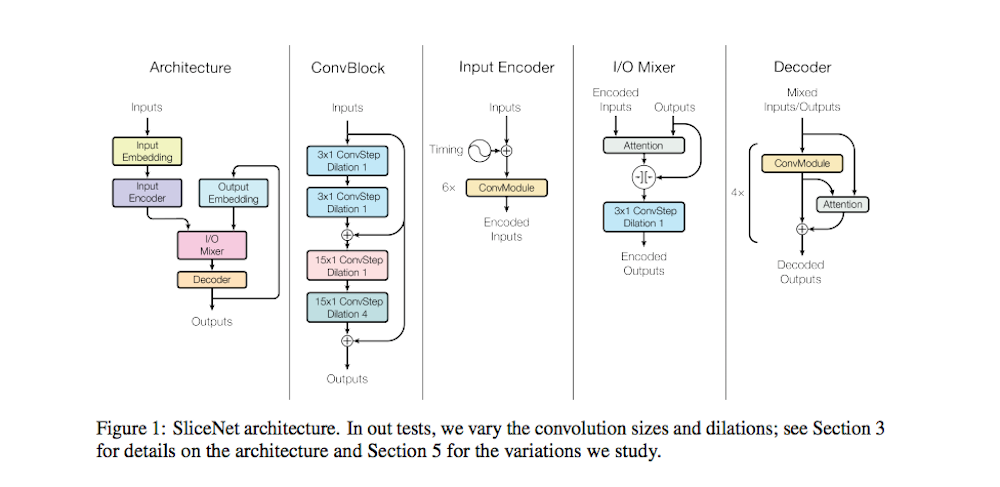
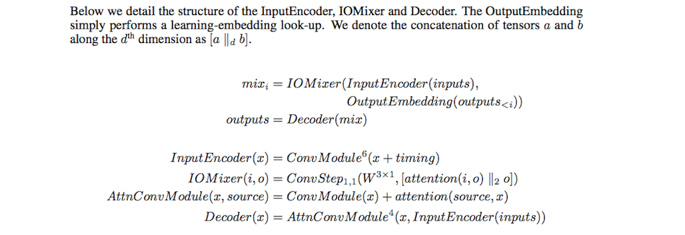

# Depthwise Separable Convolutions for Neural Machine Translation

- Submitted on 2017. 6
- Lukasz Kaiser, Aidan N. Gomez, Francois Chollet

## Simple Summary

> Introduce a new architecture inspired by Xception and ByteNet, called SliceNet, which enables a significant reduction of the parameter count and amount of computation needed to obtain results like ByteNet, and, with a similar parameter count, achieves new state-of-the-art results. In addition to showing that depthwise separable convolutions perform well for machine translation, we investigate the architectural changes that they enable: we observe that thanks to depthwise separability, ... introduce a new "super-separable" convolution operation that further reduces the number of parameters and computational cost for obtaining state-of-the-art results.

- Inspried by Xception network.
- **Depthwise separable convolutions** reduce the number of parameters and computation used in convlutional operations while increasing representational efficiency.
	- SepConv = Depthwise -> Pointwise (1x1 conv)
	- Fundamental idea = A spatial feature learning step -> A channel combination step

- The number of parameters of regular, separable and group convolutions.
- **super-separable**: 
	1. tensor `x` 
	2. split on the depth dimentions into `g` groups 
	3. apply a seperable convolution to each group separately
	4. concat the results 

- Architecture

- use stack of depthwise separble convolution layers with residual connections.

- BLEU 26.1 on the WMT'14 English-German data (newstest2014)

