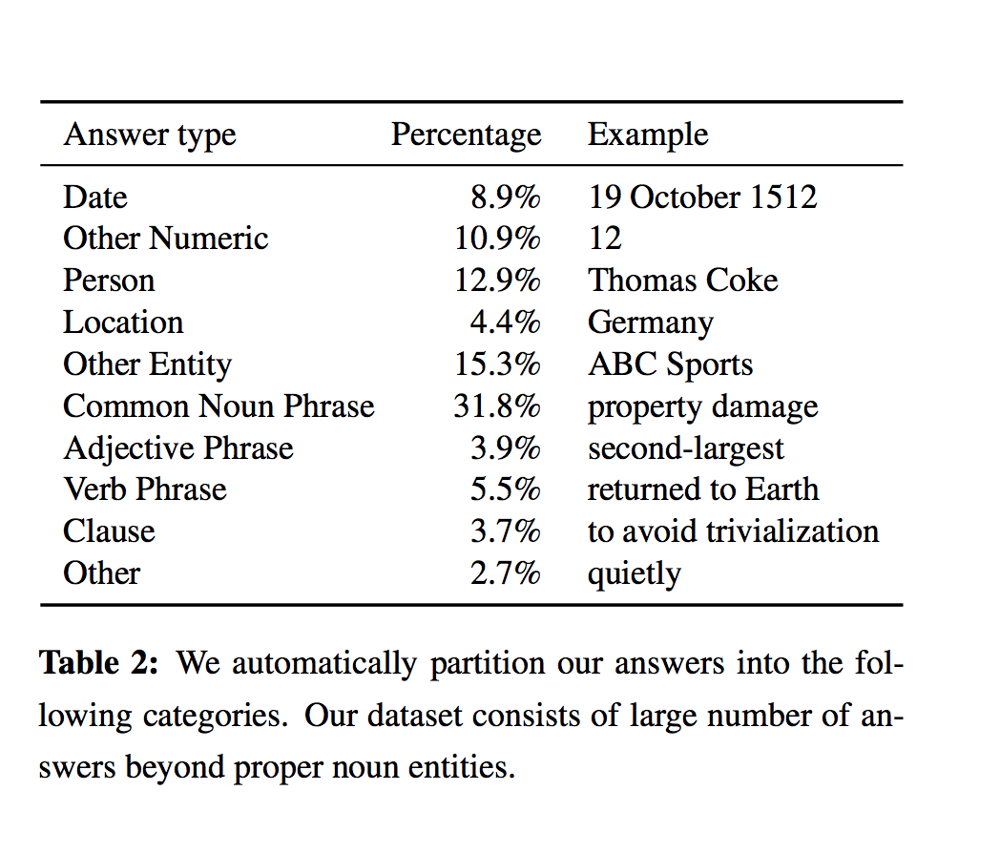

# SQuAD: 100,000+ Questions for Machine Comprehension of Text

- Submitted on 2016. 6
- Pranav Rajpurkar, Jian Zhang, Konstantin Lopyrev and Percy Liang

## Simple Summary

> Stanford Question Answering Dataset (SQuAD), a new reading comprehension dataset consisting of 100,000+ questions posed by crowdworkers on a set of Wikipedia articles, where the answer to each question is a segment of text from the corresponding reading passage.

- https://rajpurkar.github.io/SQuAD-explorer/
- a large reading comprehension dataset on Wikipedia articles with crowdsourced.
- 107,785 question-answer pairs on 536 articles ~500 articles from Wikipedia and size 100K.
- human performance: 86.8 F1, 77% exact match
- answer types

