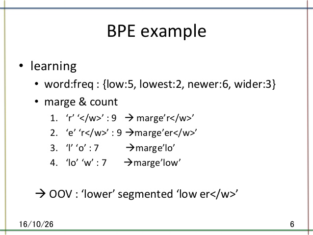
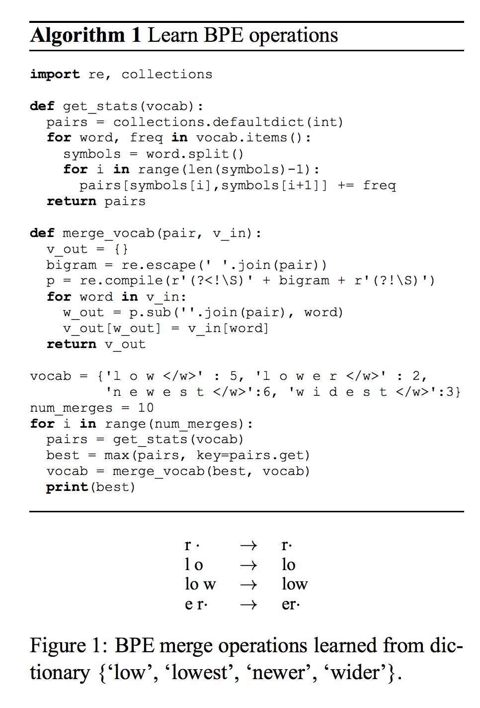

## Neural Machine Translation of Rare Words with Subword Units

- published in 2015. 8
- Rico Sennrich, Barry Haddow and Alexandra Birch

----

### Simple summary

- This is **data processing** technique not model artitecture.
- Introduce a simpler and more effective approach, making the NMT model capable of open-vocabulary translation by encoding rare and unknown words as sequences of subword units.
- Rare word categories
	- named entities
	- cognates and loanwords
	- morphologically complex words.
- Our hypothesis is that a **segmentation of rare
words into appropriate subword units** is suffi-
cient to allow for the neural translation network
to learn transparent translations, and to generalize
this knowledge to translate and produce unseen
words.

- Byte Pair Encoding (BPE) : simple data compression technique
	-  iteratively replaces the most frequent pair of bytes in a sequence with a single, unused byte.

