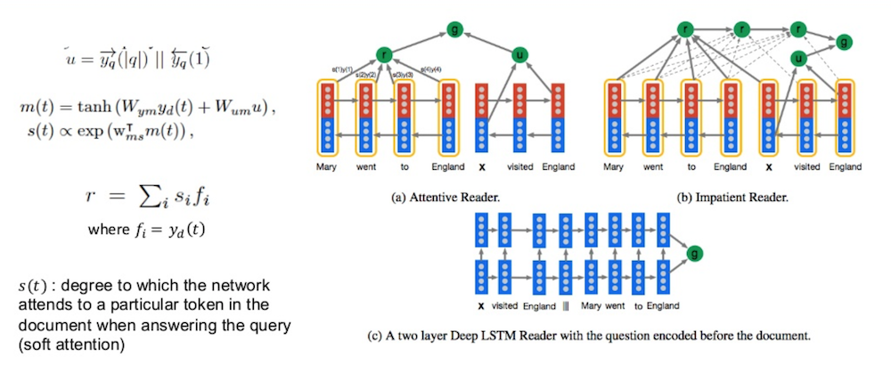
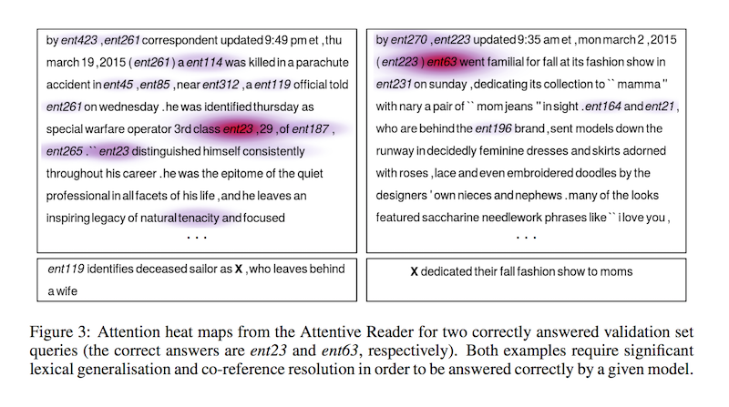

# Teaching Machines to Read and Comprehend

- published in 2015. 6
- Karl Moritz Hermann, Tomáš Kočiský, Edward Grefenstette, Lasse Espeholt, Will Kay, Mustafa Suleyman and Phil Blunsom

## Simple Summary

- Define a new methodology that resolves the bottleneck and provides large scale supervised reading comprehension data.

- Dataset : CNN and Daily Mail
- Model
	- Deep LSTM: 2-layer bidirectional LSTM without attention mechanism
	- Attentive reader: 1-layer bidirectional LSTM with attention mechanism for the whole query (focus on the passages of a context document that are most likely to inform the answer to the query)
	- Impatient Reader: 1-layer bidirectional LSTM with attention mechanism for each token in the query (allows the model to recurrently accumulate information
from the document as it sees each query token, ultimately outputting a final joint document query
representation for the answer prediction)
	- Uniform Reader: Uniform attention to all document tokens
- Attention visualization

