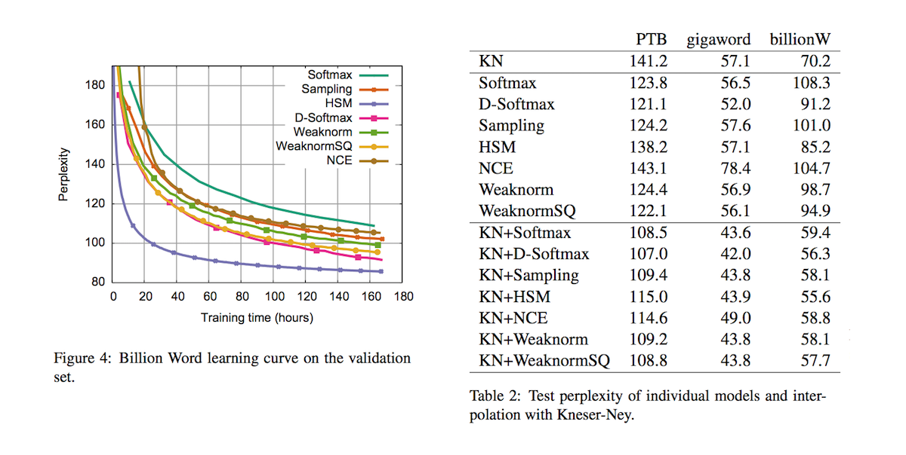

# Strategies for Training Large Vocabulary Neural Language Models

- published in 2015. 12
- Welin Chen, David Grangier and Michael Auli

## Simple Summary

- Present a systematic comparison of strategies to represent and train large vocabularies
- Strategies
	- **softmax** : over all output classes
	- **hierarchical softmax** : introduces latent variables, or clusters, to simplify normalization   
	- **Differentiated Softmax** : adjusting capacity based on token frequency (a novel variation of softmax which assigns more capacity to frequent words and which we show to be faster and more accurate than softmax)
	- **target sampling** : only considers a random subset of classes for normalization
	- **noise contrastive estimation** : discriminates between genuine data points and samples from a noise distribution
	- **Infrequent Normalization (self normalization)** : computes the partition
function at an infrequent rate.

