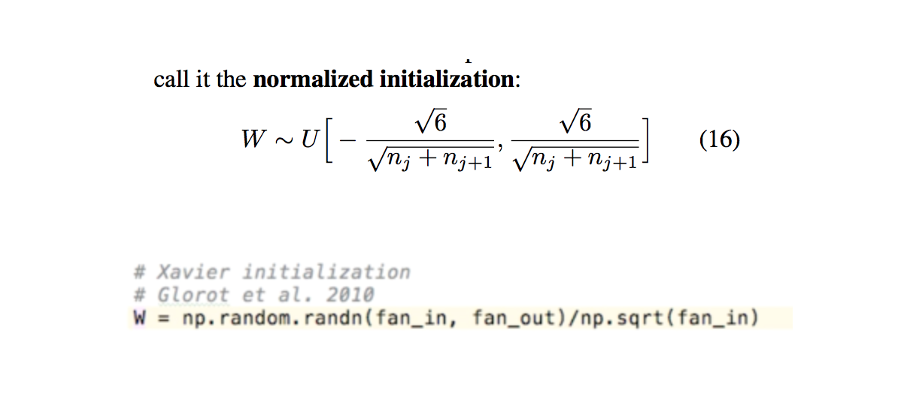
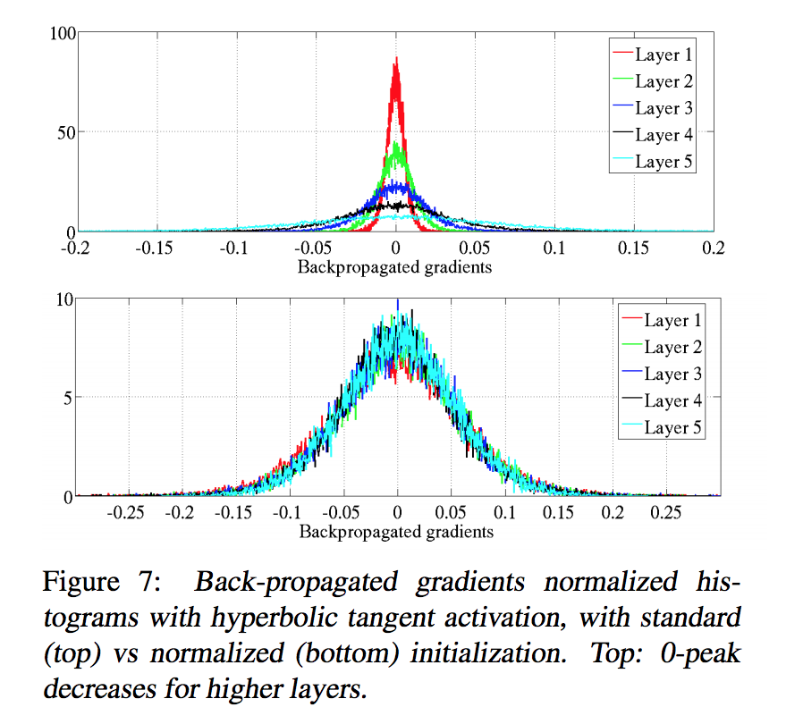

# Understanding the difficulty of training deep feedforward neural networks

- Submitted on 2010. 5
- Xavier Glorot and Yoshua Bengio

## Simple Summary

>  Our objective here is to understand better why standard gradient descent from random initialization is doing so poorly with deep neural networks, to better understand these recent relative successes and help design better algorithms in the future... we study how activations and gradients vary across layers and during training, with the idea that training may be more difficult when the singular values of the Jacobian associated with each layer are far from 1. Based on these considerations, we propose a new initialization scheme that brings substantially faster convergence

- if the weights in a network start too small, then the signal shrinks as it passes through each layer until it's too tiny to be useful.
- if the weights in a network too large, then the signal grows as it passes through each layer until it's too massive to be useful.

- **Xavier initialization** makes sure the weight are 'just right', keeping the signal in a reasonable range of values through many layers.

