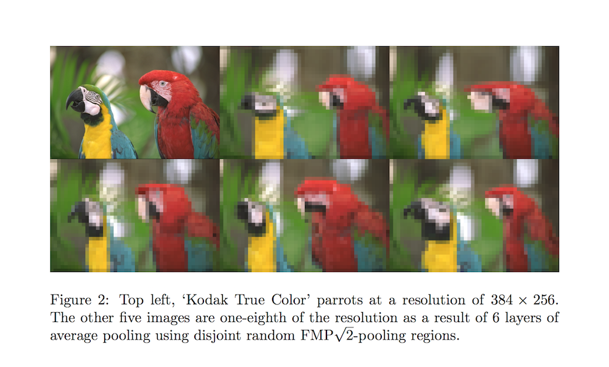
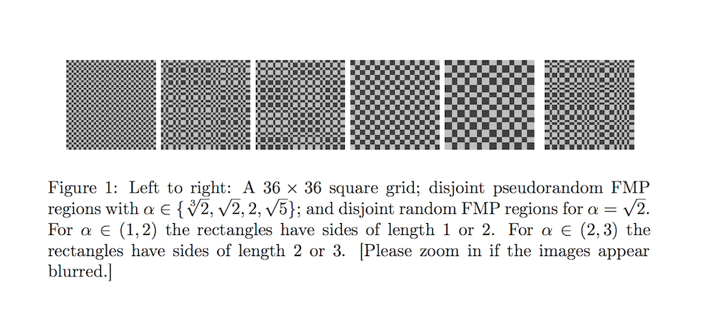

# Fractional Max-Pooling

- Submitted on 2014. 12
- Benjamin Graham

## Simple Summary

> Our version of max-pooling is stochastic as there are lots of different ways of constructing suitable pooling regions. We find that our form of fractional max-pooling reduces overfitting on a variety of datasets.

- Spatial pooling layers are building blocks for Convolutional Neural Networks (CNNs).
- **Max Pooling 2x2**
	- Pros:
		1. Fast.
		2. Quickly reduces the size of the hidden layer.
		3. Encodes a degree of invariance with respect to translations and elastic distortions.
	- Cons:
		1. Disjoint nature of pooling regions.
		2. Since size decreases rapidly, stacks of back-to-back CNNs are needed to build deep networks.

- **Fractional Max-Pooling**
	- Reduces the spatial size of the image by a factor of α, where α ∈ (1, 2).
	- Introduces randomness in terms of choice of pooling region.
	- Pooling regions can be chosen in a random or pseudorandom manner.
	- Pooling regions can be disjoint or overlapping.
	- Random FMP is good on its own but may underfit when combined with dropout or training data augmentation.