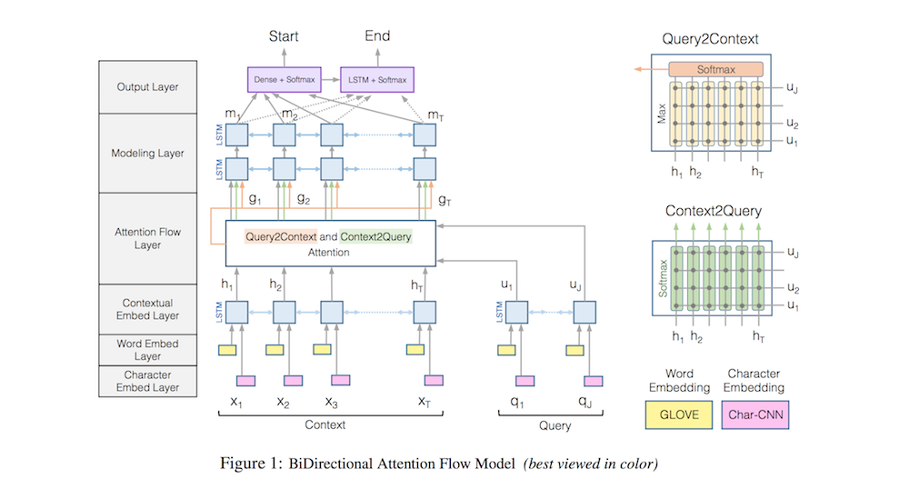

# Bidirectional Attention Flow for Machine Comprehension

- Submitted on 2016. 11
- Minjoon Seo, Aniruddha Kembhavi, Ali Farhadi and Hannaneh Hajishirzi

## Simple Summary

> Introduce the Bi-Directional Attention Flow (BIDAF) network, a multi-stage hierarchical process that represents the context at different levels of granularity and uses bi-directional attention flow mechanism to obtain a query-aware context representation without early summarization.

- Attention Mechanism
	1. attention layer is not used to summarize the context paragraph into a fixed-size vector. allowed to flow through to the subsequent modeling layer.
	2. use a memory-less attention mechanism. 
	    - the attention at each time step is a function of only the query and the context paragraph at the current time step and does not directly depend on the attention at the previous time step. (leads to the division of labor between the attention layer and the modeling layer)
	3. use attention mechanisms in both directions, query-to-context and context-to-query, which provide complimentary information to each other.  

- Model

1. Character Embedding: Layer maps each word to a vector space using character-level CNNs.
2. Word Embedding Layer: maps each word to a vector space using a pre-trained word embedding model.
3. Contextual Embedding Layer: utilizes contextual cues from surrounding words to refine the embedding of the words. These first three layers are applied to both the query and context.
4. Attention Flow Layer: couples the query and context vectors and produces a set of queryaware feature vectors for each word in the context.
5. Modeling Layer: employs a Recurrent Neural Network to scan the context.
6. Output Layer: provides an answer to the query.

- Experiments (achieves the state-of-the-art results)
	- SQuAD: EM 68.0, F1 77.3
	- CNN: val 76.3, test 76.9
	- DailyMail: val 80.3, test 79.6