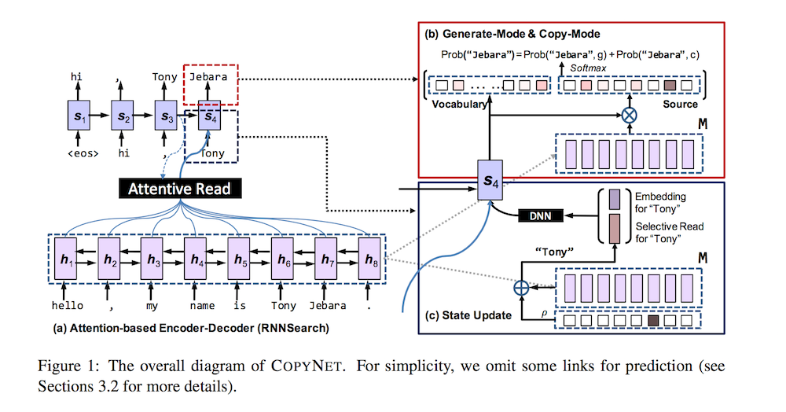
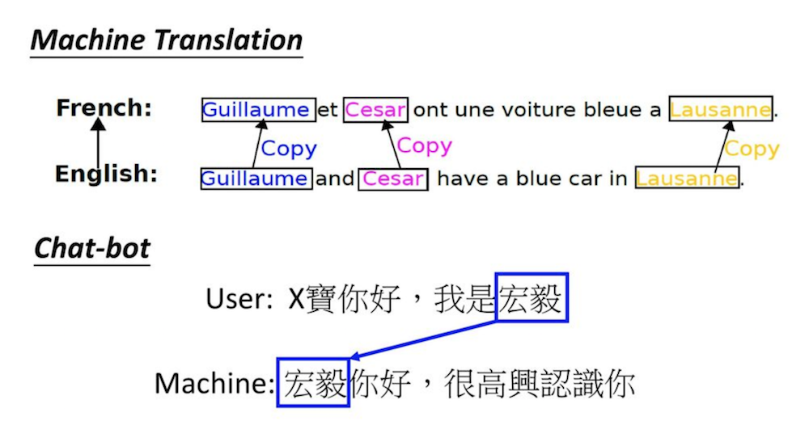

# Incorporating Copying Mechanism in Sequence-to-Sequence Learning

- Submitted on 2016. 3
- Jiatao Gu, Zhengdong Lu, Hang Li and Victor O.K. Li

## Simple Summary

> address an important problem in sequence-to-sequence (Seq2Seq) learning referred to as copying, in which certain segments in the input sequence are selectively replicated in the output sequence. A similar phenomenon is observable in human language communication.

- cognitive perspective, the copying mechanism is related to rote memorization, requiring less understanding but ensuring high literal fidelity.
- Encoder - Same as in (Bahdanau et al., 2014)
- Decoder
	- Prediction: **generate-mode** and **copy-mode**
	- Statue update: location-specific hidden state
	- Reading M: selective read

