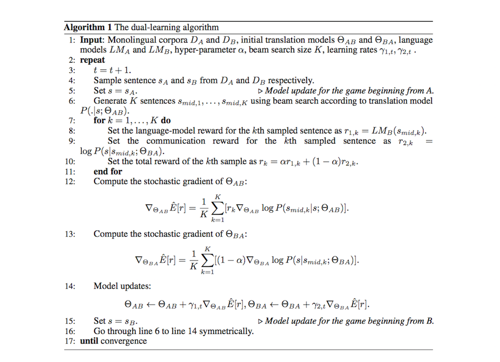
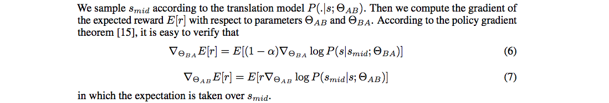

# Dual Learning for Machine Translation

- Submitted on 2016. 11
- Yingce Xia, Di He, Tao Qin, Liwei Wang, Nenghai Yu, Tie-Yan Liu, and Wei-Ying Ma

## Simple Summary

>  A dual-learning mechanism, which can enable an NMT system to automatically learn from unlabeled data through a dual-learning game. This mechanism is inspired by the following observation: any machine translation task has a dual task, e.g., English-to-French translation (primal) versus French-to-English translation (dual) ... use one agent to represent the model for the primal task and the other agent to represent the model for the dual task, then ask them to teach each other through a reinforcement learning process.

- Two-agent communication game.
	1. A agent, understand langague A, sends a message language A to the B agent through a noisy channel.
	2. B agent, understand language B, receives the translated message in language B. notifies the A agent whether it is a natural sentence in language B. Then the received message back to the first agent through another noisy channel.
	3. A agent check it and notifies the B agent whether the message she receives is consistent with her original message.
	4. The game can also be started from the B agent
- the two agents will go through a symmetric process and improve the two channels (translation models) according to the feedback.

- Dual learning mechanism features
	1. train translation models from unlabeled data through reinforcement learning.
	2. demonstrate the power of deep reinforcement learning (DRL) for complex real-world applications, rather than just games.

- Experiments
	- En -> Fr (Large): 29.92 -> 32.06
	- Fr -> En (Large): 27.49 -> 29.78
	- En -> Fr (Small): 25.32 -> 28.73
	- Fr -> En (Small): 22.27 -> 27.50