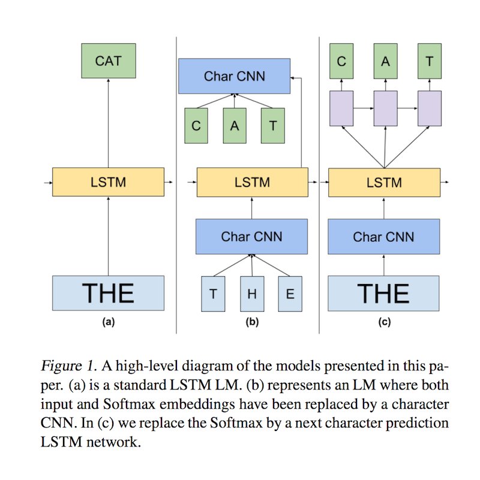
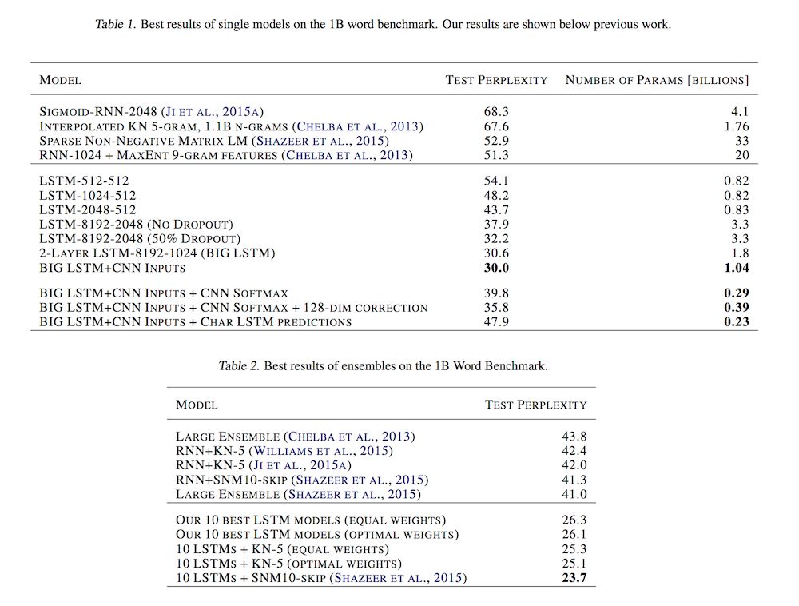
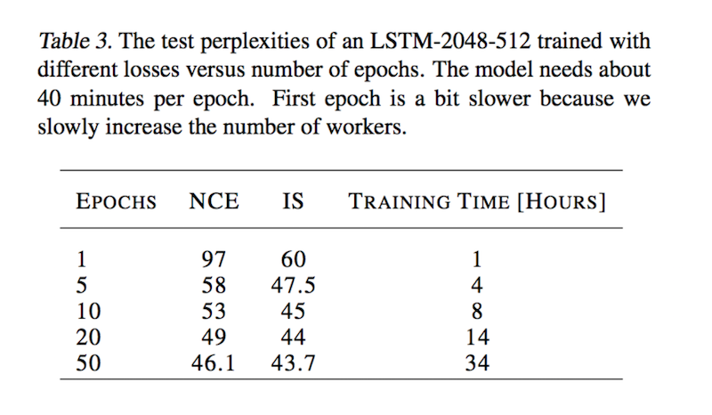

# Exploring the Limits of Language Modeling

- Submitted on 2016. 2
- Rafal Jozefowicz, Oriol Vinyals, Mike Schuster, Noam Shazeer and Yonghui Wu

## Simple Summary

> explore recent advances in Recurrent Neural Networks for large scale Language Modeling, a task central to language understanding... perform an exhaustive study on techniques such as character Convolutional Neural Networks or Long-Short Term Memory



- LSTM
- CNN Inputs: characterlevel inputs to build word embeddings
- Noise Contrastive Estimation(NCE) and Importance Sampling(IS)
- CNN Softmax: produce ```e_w``` with a CNN over the characters of ```w``` as ```e_w = CNN(chars_w)```
- Char LSTM Prediction




