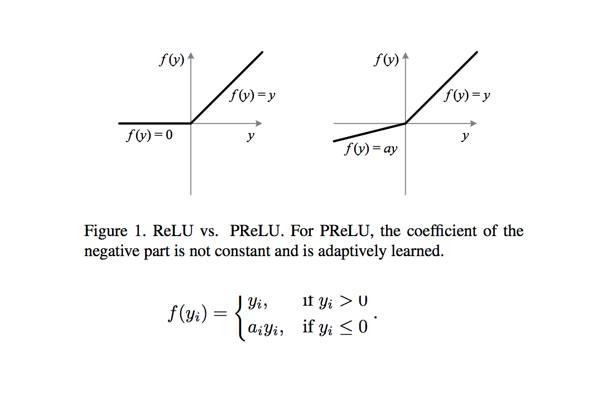
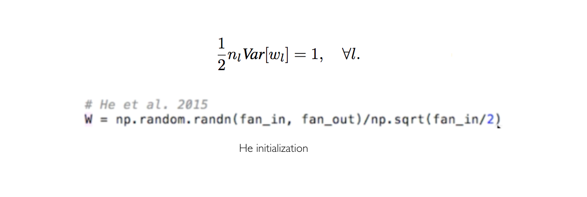

# Delving Deep into Rectifiers: Surpassing Human-Level Performance on ImageNet Classification

- Submitted on 2015. 2
- Kaiming He, Xiangyu Zhang, Shaoqing Ren and Jian Sun

## Simple Summary

>  propose a Parametric Rectified Linear Unit (PReLU) that generalizes the traditional rectified unit. PReLU improves model fitting with nearly zero extra computational cost and little overfitting risk. Second, we derive a robust initialization method that particularly considers the rectifier nonlinearities. This method enables us to train extremely deep rectified models directly from scratch and to investigate deeper or wider network architectures. 

- PReLU, adaptively learns the parameters

- The idea is that the ReLU will completely eliminate the negative signals and double the dispersion that they have to maintain.

- achieves 4.94% top-5 error
