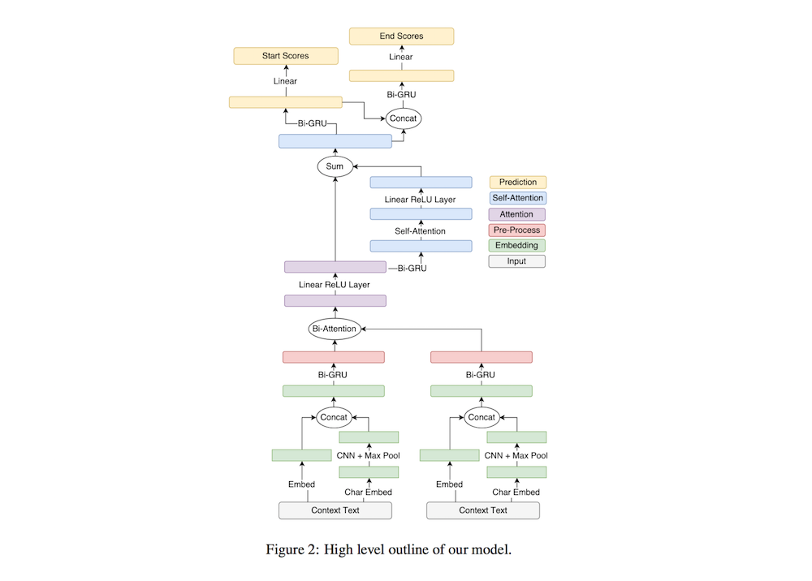
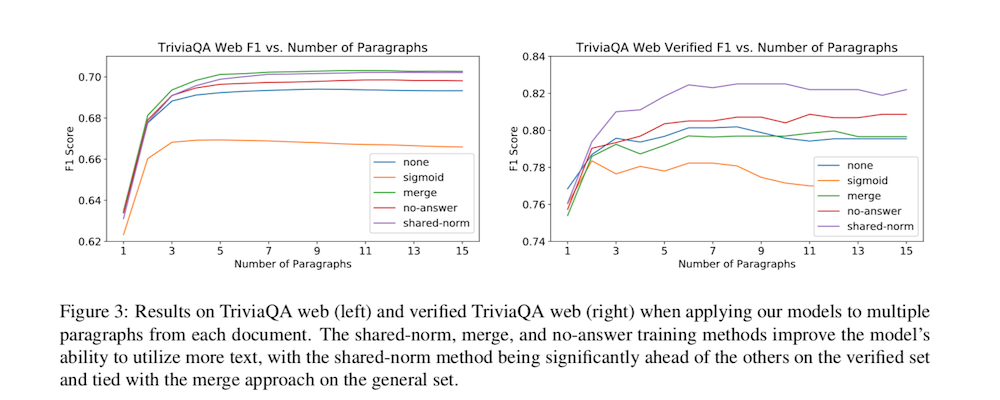

# Simple and Effective Multi-Paragraph Reading Comprehension

- Submitted on 2017. 10
- Christopher Clark, Matt Gardner

## Simple Summary

> Consider the problem of adapting neural paragraph-level question answering models to the case where entire documents are given as input. Our proposed solution trains models to produce well calibrated confidence scores for their results on individual paragraphs. We sample multiple paragraphs from the documents during training, and use a shared-normalization training objective that encourages the model to produce globally correct output. We combine this method with a state-of-the-art pipeline for training models on document QA data.

- requires adapting a paragraph-level model to process document-level input.
	- entire documents as input is extremely computationally expensive

	
- Pipelined Method
	- select a single paragraph from the input documents (the smallest TF-IDF cosine distance with the question) 
		- selected paragraph containing the correct answer: 83.% -> 85.1% on TriviaQA 
	- handling Noisy Labels
		- use a summed objective function that optimizes the sum of the proba- bilities of all answer spans.

		
- Model
	- Embeding: word-level + char-level
	- Pre-Process:  bi-directional GRU
	- Attention: BiDAF -> Self-Attention
	- Prediction, variational dropout

- Confidence based methods
	- the boundary-based models we use here, a span’s score is the sum of the start and end score given to its start and end token. At test time we run the model on each paragraph and select the answer span with the highest confidence.
	- hypothesize that there are two key reasons a model’s confidence scores might not be well calibrated.
		1. for models trained with the softmax objective, the pre-softmax scores for all spans can be arbitrarily increased or decreased by a constant value without changing the resulting softmax probability distribution. 
		2. if the model only sees paragraphs that contain answers, it might become too confident in heuristics or patterns that are only effective when it is known a priori that an answer exists. 
	- four approaches to training models to produce comparable confidence scores
		1. Shared-Normalization: a modified objective function is used where the normalization fac- tor in the softmax operation is shared between all paragraphs from the same context. (this will force the model to produce scores that are comparable between paragraphs)
		2. Merge: concatenating all paragraphs sam- pled from the same context together
		3. No-Answer Option
		4. Sigmoid 

- Experiments

- the shared-norm approach to be the most effective way
- found that models that have only been trained on answer-containing paragraphs can perform very poorly in the multi-paragraph setting. (SQuAD)
	- the paragraphs are shorter, so the model had less exposure to irrelevant text.