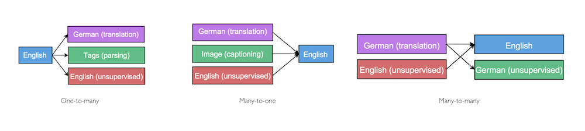

## Multi-task Sequence to Sequence Learning

- published in 2015. 11
- Minh-Thang Luong, Quoc V. Le, Ilya Sutskever, Oriol Vinyals and Lukasz Kaiser

----

### Simple summary

- This paper examines three **multi-task learning (MTL)** settings for sequence to sequence models.
- One-to-many setting (one encoder -> multi decoder)
	- Translation (EN -> GER) + Parsing (EN) = improve both
- Many-to-one setting (multi encoder -> one decoder)
	- Captioning + Translation (GER -> EN) = improve both
- Many-to-many setting (multi encoder -> multi decoder)
	- Translation (EN <-> GER) + Autoencoders or Skip-Thought. (improve Skip-Tought case )

- Interesting.