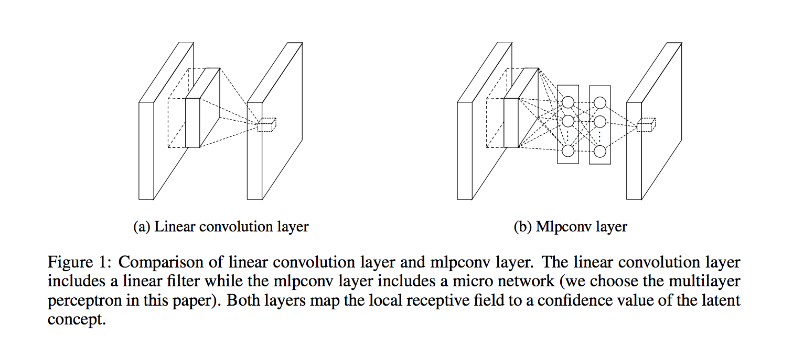

# Network In Network

- Submitted on 2013. 12
- Min Lin, Qiang Chen and Shuicheng Yan

## Simple Summary

> "Network In Network" (NIN) to enhance model discriminability for local patches within the receptive field. The conventional convolutional layer uses linear filters followed by a nonlinear activation function to scan the input. Instead, we build micro neural networks with more complex structures to abstract the data within the receptive field.

- Mlpconv layer with “micronetwork” within each conv layer to compute more abstract features for local patches.
- Micronetwork uses multilayer perceptron (FC, i.e. 1x1 conv layers)
- Precursor to GoogLeNet and ResNet “bottleneck” layers.
- Philosophical inspiration for GoogLeNet.