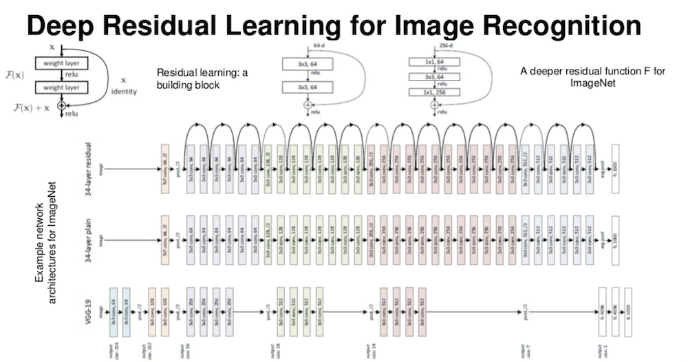

# Deep Residual Learning for Image Recognition

- published in 2015. 12
- Kaiming He, Xiangyu Zhang, Shaoqing Ren and Jian Sun

## Simple Summary

- Present a residual learning framework to ease the training of networks that are substantially deeper than those used previously.
	- Deeper networks experience a degradation problem
- 152 layers and 3.57 error rate.
- No additional parameters or computational complexity are introduced by residuals nets.
- **Residual Mapping**
	- F(x) = H(x) - x

