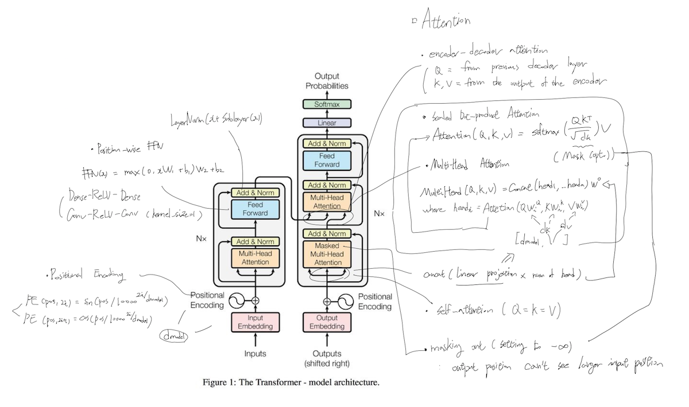

# transformer: Attention Is All You Need 

- 2017. 6
- Google brain’s paper by Ashish Vaswani, Noam Shazeer, Llion Jones, Niki Parmar, Jakob Uszkoreit, Aidan N. Gomez, and Łukasz Kaiser

## Architecture

## Simple Summary

- Problem
	- Seq2Seq encode an input into a fixed-size vector (both short and long input sentence). This is not a human's translate method.
	- Seq2Seq's computation is sequential. It is slow (Can't be parallel).

- Faster and better performance (WMT 2014 English-to-German translation task: over 2 BLEU score)
- Do not use RNN or CNN 
- Using Backpropagation not BPTT

- Positional Encoding : sinusodial (sin and cos functions of different frequencies)
- Attention: An attention function can be described as mapping a query and a set of key-value pairs to an output, where the query, keys, values, and output are all vectors. The output is computed as a weighted sum of the values, where the weight assigned to each value is computed by a compatibility function of the query with the corresponding key
	- Multi-Head : num of heads (only for speed?) h=1 -> h=8 (better performance)
	- multi-head attention allows the model to jointly attend to information from different representation subspaces at different locations
- Allows for parallelization which in turn leads to significantly shorter training time.
- performs well about 'coreference resolution'